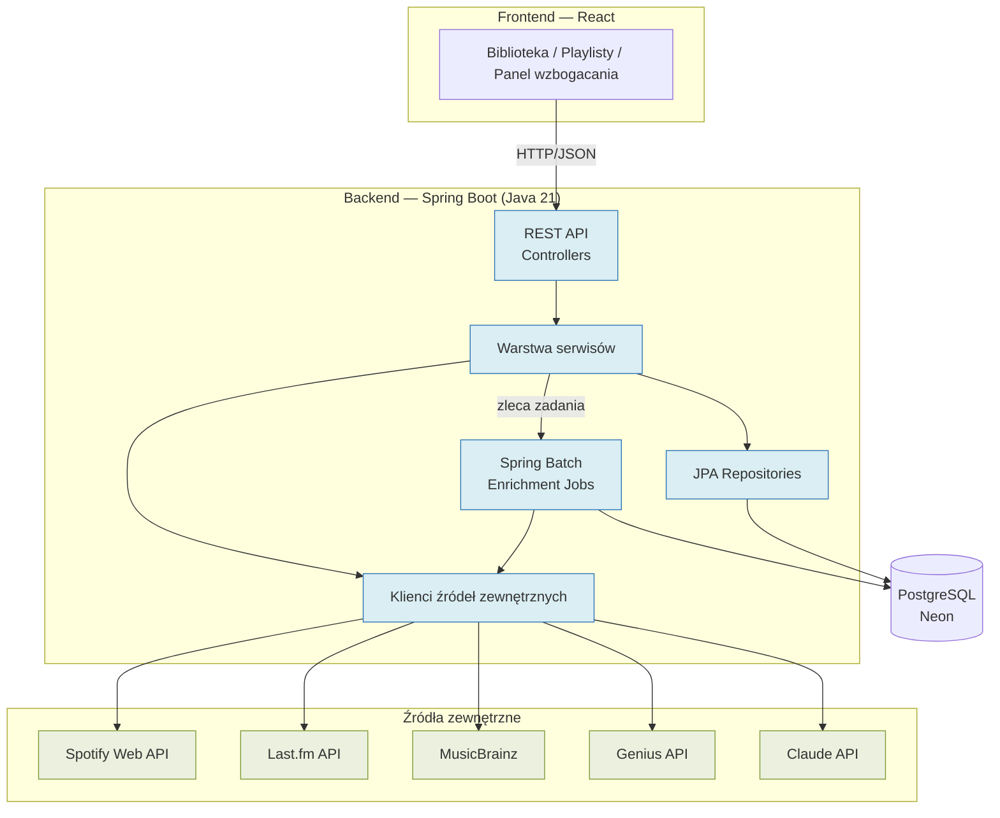
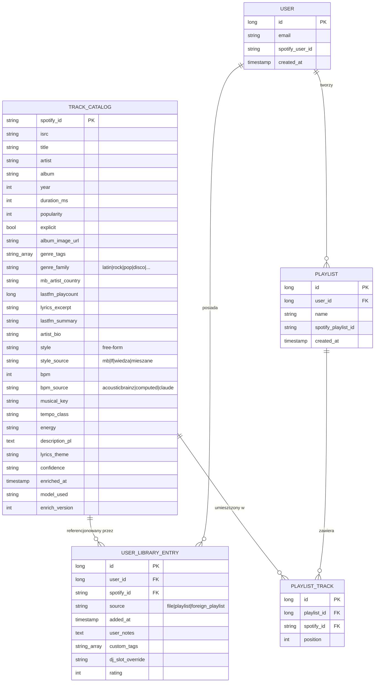
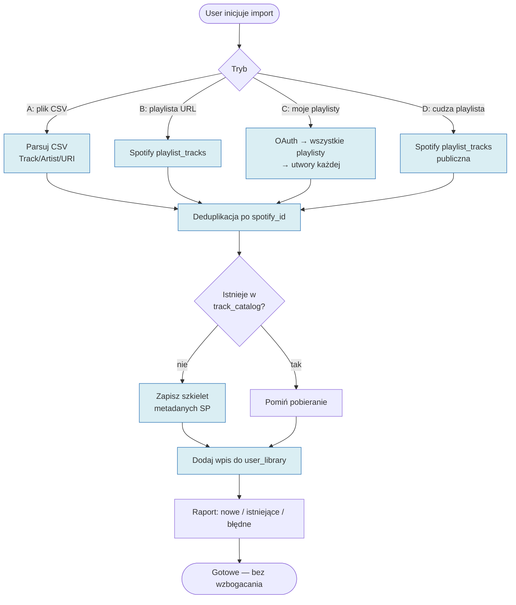
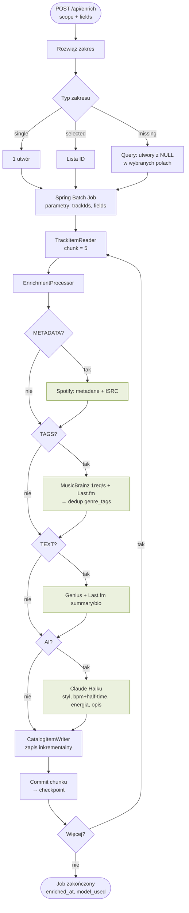
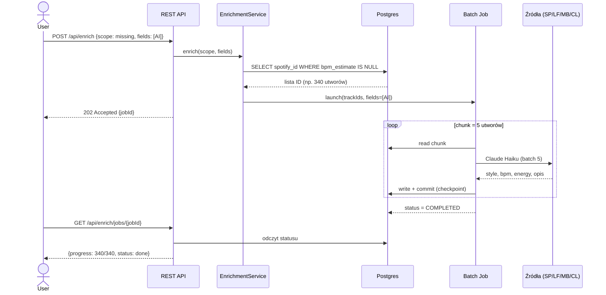
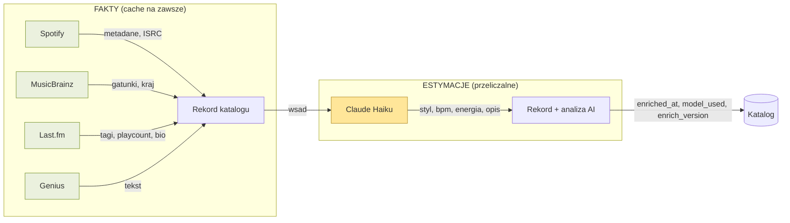
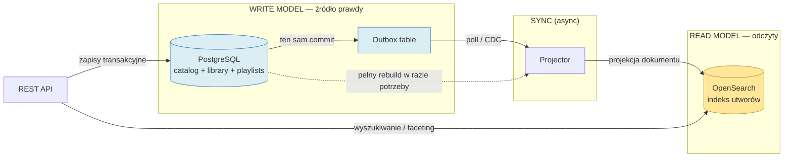

> **Adnotacja (2026-07-03):** To jest oryginalny dokument koncepcyjny (specyfikacja źródłowa).
> Część decyzji została zrewidowana po jego powstaniu — m.in. wycofanie multi-user (Etap 3),
> odchudzenie zestawu pól i źródeł danych, zmiana pakietu bazowego na `com.pgoogol` oraz
> rezygnacja ze sztywnego wyboru Claude/Anthropic w warstwie analizy utworów — dowolny
> provider LLM za abstrakcją (D15).
> Obowiązujące rozstrzygnięcia: [DECYZJE.md](DECYZJE.md). Rozbicie pracy: [PLAN.md](PLAN.md).

# Sabor Latino — Music Library & DJ Tooling
### Pełny koncept projektu (założenia + architektura) — do rozpoczęcia pracy w Claude Code

> Aplikacja **genre-agnostyczna** do zarządzania biblioteką muzyczną DJ-a. Obsługuje dowolny
> gatunek (rock, pop, disco, disco polo, elektronika, latino itd.). „Sabor Latino" to marka
> DJ-ska właściciela; silnik biblioteki i wzbogacania jest uniwersalny.

---

# CZĘŚĆ I — ZAŁOŻENIA

## 1. Cel

Aplikacja wzbogaca utwory o metadane (BPM, styl, temat, energia, tagi gatunkowe), pozwala
przeszukiwać bibliotekę i planować playlisty/sety. Start jako narzędzie osobiste,
z możliwością otwarcia dla innych użytkowników w przyszłości.

## 2. Kluczowe decyzje architektoniczne

### 2.1 Współdzielony katalog + prywatna biblioteka
Dane wzbogacenia (tagi, BPM, styl, opis) są **deterministyczne i identyczne dla wszystkich
użytkowników** — zależą tylko od utworu, nie od tego kto go ma.
- **`track_catalog`** — globalny, współdzielony, kluczowany po Spotify ID / ISRC.
  Każdy unikalny utwór wzbogacany **raz** → koszt Claude API płacony raz na utwór.
- **`user_library`** — referencje do katalogu + dane prywatne (notatki, custom tagi, override).

Efekt: przy wielu użytkownikach o podobnych gustach koszt Claude nie rośnie liniowo.

### 2.2 Pipeline oddzielony od aplikacji
Wzbogacanie ~2500 utworów to długi proces ograniczony rate-limitami — NIE mieści się
w request/response ani w serverless (timeouty).
- **Pipeline** = Spring Batch job. Restartowalny, throttlowany, batchuje wywołania Claude, pisze do bazy.
- **Aplikacja** = REST API + front. Czyta z bazy. Zleca zadania wzbogacania (§5).

### 2.3 Fakt vs estymacja — kręgosłup modelu danych
- **Fakty** (Spotify/Last.fm/MusicBrainz): pobierasz raz, cache na zawsze.
- **Estymacje** (Claude): można przeliczyć przy zmianie modelu/promptu bez ponownego
  odpytywania API. Stąd pola `model_used` i `enrich_version`.

### 2.4 Schemat zablokowany na starcie
Model danych to jedyna kosztowna rzecz do zmiany. Ustalany raz, żyje w pipeline, bazie i API.

## 3. Stack

| Warstwa       | Wybór                          | Uzasadnienie                                                    |
|---------------|--------------------------------|----------------------------------------------------------------|
| Backend       | **Spring Boot (Java 21+)**     | Znajomość; jeden kod dla pipeline + API; gotowy ruleset CLAUDE.md |
| Pipeline      | **Spring Batch**               | Chunk processing, restart po awarii, retry+backoff, throttling → gwarancja kompletu danych |
| Frontend      | **React (Next.js lub Vite)**   | Vite+React wystarczy dla narzędzia za loginem; Next jeśli SSR   |
| Baza          | **PostgreSQL**                 | Znajomość z JPA; natywne tablice (`genre_tags[]`); dobre wyszukiwanie |
| Hosting DB    | **Neon** (serverless Postgres) | Hojny free tier, skaluje do zera                               |
| Hosting API   | **Railway / Fly.io**           | Dobra obsługa kontenerów JVM (JVM nie lubi serverless — zimne starty) |
| Hosting front | **Vercel** (lub obok API)      | Najlepszy DX dla React/Next                                    |

Język: **Java** na start (Kotlin można dopisać później — współistnieją). Go świadomie
odrzucony (jego przewagi konkurują z tym, co Spring Batch daje za darmo).

## 4. Wczytywanie utworów (ingestion)

Cztery tryby wejścia. Wszystkie prowadzą do tego samego: dopisanie utworów do
`user_library` + zapewnienie, że istnieją w `track_catalog` (jako szkielet metadanych SP,
bez wzbogacenia — to osobny krok, §5).

| Tryb                             | Wejście                   | Uwagi                                                        |
|----------------------------------|---------------------------|-------------------------------------------------------------|
| **A. Plik**                      | CSV (Exportify / własny)  | Parsowanie Track/Artist/Album/Spotify URI. Batch import.    |
| **B. Pojedyncza playlista**      | URL playlisty użytkownika | Spotify API `playlist_tracks`, paginacja                    |
| **C. Wszystkie playlisty usera** | konto (OAuth)             | `current_user_playlists` → utwory każdej. Dedup wspólnych.   |
| **D. Cudza playlista**           | URL publicznej playlisty  | Jak B, ale bez własności — tylko odczyt publicznej          |

**Wspólne zasady:**
- Deduplikacja po `spotify_id` — utwór już w katalogu nie jest pobierany ponownie.
- Import **rozdziela metadane od wzbogacenia**: najpierw szybko wciąga szkielet (SP),
  potem osobno (na żądanie usera) leci wzbogacanie.
- Tryby B/C wymagają OAuth; A/D działają na Client Credentials (poza C, które zna konto).
- Wynik importu: raport ile nowych / ile już było / ile błędnych.

## 5. Wzbogacanie selektywne (enrichment)

User **wybiera zakres** (które utwory) ORAZ **wybiera pola** (które dane uzupełnić).
Nie „wszystko albo nic".

### 5.1 Zakres (które utwory)

| Zakres                  | Opis                                                              |
|-------------------------|------------------------------------------------------------------|
| **Pojedynczy utwór**    | Jeden wskazany track                                             |
| **Wybrane utwory**      | Zaznaczone na liście (multi-select)                             |
| **Wszystkie brakujące** | Tylko utwory z brakiem wybranych pól — nie przetwarza ponownie wypełnionych |

### 5.2 Pola (które dane) — selektywnie

| Grupa pól          | Źródło                              | Koszt / limit                     | Pola                                    |
|--------------------|-------------------------------------|-----------------------------------|-----------------------------------------|
| **Metadane**       | Spotify (+ iTunes dla preview/okładek) | darmowe, szybkie               | title, artist, album, year, duration, isrc, popularity, okładka, preview_url |
| **Tagi gatunkowe** | Last.fm + MusicBrainz + Discogs     | darmowe; MB 1 req/s               | genre_tags[], kraj artysty, playcount   |
| **BPM / audio**    | AcousticBrainz → własna analiza previewu → (Claude) | **darmowe**       | bpm (realne), tempo_class, key, energy_audio |
| **Tekst/kontekst** | Genius + Last.fm                    | darmowe; zależy od dostępności    | lyrics_excerpt, lastfm_summary, artist_bio |
| **Analiza AI**     | Claude                              | **płatne** (Haiku) — jedyny koszt | style (konsolidacja), description_pl, lyrics_theme, energy, confidence, bpm_estimate (tylko fallback) |

**Zmiana strategii BPM (ważne):** nie polegamy na cudzym pre-liczonym BPM (lookup-API mają
dziury w pokryciu). Kolejność: **AcousticBrainz** (darmowy dump, realne BPM po MBID —
dla utworów starszych/popularnych) → **własna analiza 30-sek. previewu** (pobieramy klip
z iTunes Search API i liczymy BPM lokalnie — pokrycie praktycznie pełne, wartość realna) →
**Claude** (estymacja tylko gdy brak previewu). Szczegóły w §16.1 i §16.4.

**Logika „brakujące":** dla zaznaczonych pól sprawdzane jest, czy są puste. Np. „BPM dla
wszystkich brakujących" → leci tylko gdzie `bpm IS NULL`. Pozwala dokupować dane etapami.

**Zależności grup:** Analiza AI jest lepsza z wypełnionymi Tagami/Tekstem (Claude dostaje je
jako wsad). UI sugeruje, ale nie wymusza.

### 5.3 Technicznie
- Każde zlecenie = **Spring Batch job** z parametrami `scope` (utwory) + `fields` (grupy pól).
  Restartowalny.
- Pojedynczy/kilka = synchronicznie lub przez tę samą kolejkę.
- Wszystkie brakujące = asynchronicznie, status w UI.
- Zapis inkrementalny do `track_catalog` — częściowy postęp zawsze zachowany.

## 6. Minimalizacja kosztów (twarde kryterium)

1. **Darmowe źródła faktów przed Claude** (§16.4) — BPM z AcousticBrainz lub własnej analizy
   previewu (realne, za darmo), gatunki z MB/Last.fm/Discogs. Claude schodzi do tego, czego darmowe źródła nie dają:
   konsolidacja stylu, opis PL, temat, energia. To największa oszczędność — BPM i gatunek,
   dotąd „drogie" pola AI, stają się darmowe.
2. **Współdzielony katalog** — Claude płacony raz na unikalny utwór.
3. **Claude Haiku, nie Sonnet** (~10× taniej). Model = jedna zmienna → łatwa podmiana.
4. **Selektywne wzbogacanie** (§5) — user dokupuje tylko potrzebne pola dla potrzebnych utworów.
5. **Rozdział fakt/estymacja** — przeliczasz tylko estymacje przy zmianie modelu.
6. Wzbogacanie w tle, batchowane.

## 7. Roadmapa (każdy etap samodzielnie użyteczny)

- **Etap 1** — Spring Batch pipeline + Postgres + prosty viewer. Lokalnie. Gwarantuje komplet
  danych. Ingestion tryb A (plik). Output w docelowym schemacie = ziarno bazy.
- **Etap 2** — REST API (Spring) + React front. Ingestion B/C/D. Selektywne wzbogacanie z UI.
  Biblioteka + planowanie playlist. Tylko właściciel.
- **Etap 3** (jeśli pojawią się użytkownicy) — auth, współdzielony katalog, kolejka wzbogacania
  w tle, eksport playlist na Spotify. Schemat z Etapu 1 już to przewiduje.

---

# CZĘŚĆ II — ARCHITEKTURA

## 8. Zmiany wynikające z genre-agnostycznego zakresu

| Element           | Latino-only                        | Uniwersalne                                                   |
|-------------------|------------------------------------|--------------------------------------------------------------|
| `style`           | Zamknięty enum latino              | **Free-form** z tagów LF/MB, konsolidowany przez Claude      |
| `genre_family`    | —                                  | **Nowe pole**: latin/rock/pop/disco/disco polo/electronic/hip-hop/other — do filtrowania |
| Korekta half-time | Zawsze                             | **Warunkowa** — tylko gdy konwencja gatunku wymaga (timba/salsa w połowie; pop/rock/disco 4/4 bez) |
| `tempo_class`     | Progi pod latino                   | **Uniwersalne pasma BPM**; interpretacja gatunkowa w aplikacji |
| Prompt Claude     | „Ekspert latino"                   | „Ekspert muzyczny i DJ" — latino jako podzbiór               |
| Heurystyka artystów | Listy salsa/bachata              | Nadal użyteczne, ale drugorzędne wobec tagów LF/MB           |

Reszta modelu bez zmian — rozdział fakt/estymacja, współdzielony katalog, selektywne
wzbogacanie działają identycznie niezależnie od gatunku.

## 9. Architektura systemu (wysoki poziom)



**Zasada rozdziału:** ciężkie wzbogacanie → **Spring Batch** (restartowalne, throttlowane).
Lekkie operacje (odczyt biblioteki, pojedynczy utwór, CRUD playlist) → synchronicznie przez
serwisy. Oba dzielą repozytoria i klientów źródeł.

## 10. Struktura pakietów (Spring Boot)

```
com.saborlatino
├── catalog                     # Współdzielony katalog utworów (deterministyczny)
│   ├── TrackCatalog.java
│   ├── TrackCatalogRepository.java
│   └── CatalogService.java
├── library                     # Prywatna biblioteka użytkownika
│   ├── UserLibraryEntry.java
│   ├── UserLibraryRepository.java
│   └── LibraryService.java
├── playlist                    # Playlisty / sety
│   ├── Playlist.java
│   ├── PlaylistTrack.java
│   ├── PlaylistRepository.java
│   └── PlaylistService.java
├── ingestion                   # Wczytywanie utworów (§4)
│   ├── FileIngestService.java       # tryb A — CSV
│   ├── PlaylistIngestService.java   # tryb B/C/D — Spotify
│   └── IngestController.java
├── enrichment                  # Wzbogacanie (§5)
│   ├── EnrichmentService.java       # orkiestracja, wybór zakresu/pól
│   ├── FieldGroup.java              # enum: METADATA, TAGS, TEXT, AI
│   ├── EnrichmentScope.java         # single | selected | missing
│   ├── batch
│   │   ├── EnrichmentJobConfig.java
│   │   ├── TrackItemReader.java
│   │   ├── EnrichmentProcessor.java
│   │   └── CatalogItemWriter.java
│   └── source
│       ├── SpotifyClient.java
│       ├── ITunesClient.java        # preview_url (30s), okładki
│       ├── LastFmClient.java
│       ├── MusicBrainzClient.java   # throttling 1 req/s + cache
│       ├── DiscogsClient.java       # taksonomia gatunku/stylu
│       ├── AcousticBrainzClient.java # lookup BPM po MBID (dump/baza)
│       ├── AudioAnalyzer.java       # BPM z previewu (TarsosDSP) — realny fakt
│       ├── GeniusClient.java
│       └── ClaudeClient.java        # model jako zmienna (Haiku)
├── user                        # Auth / konta
│   ├── User.java
│   ├── SpotifyOAuthService.java
│   └── AuthController.java
├── api                         # Warstwa API (DTO, mapowanie)
│   ├── dto
│   └── mapper
└── common                      # Konfiguracja, wyjątki, util
    ├── config
    ├── exception
    └── ratelimit               # throttling MB/LF
```

## 11. Model danych — diagram ER



### 11.1 Enum stylów (referencyjny — `style` jest free-form)
Typowe wartości dla latino (heurystyka, nie ograniczenie):
`timba | son cubano | salsa dura | salsa romántica | salsa colombiana | bachata |
reparto/cubatón | cha-cha-chá | mambo | guaracha | bolero | charanga | reggaeton |
pop latino`. Dla innych gatunków — dowolna wartość z tagów LF/MB.

### 11.2 `genre_family` (kontrolowany enum)
`latin | rock | pop | disco | disco polo | electronic | hip-hop | other`
Claude mapuje tagi na jedną z wartości; `style` zostaje free-form pod spodem.

### 11.3 `dj_slot` — decyzja projektowa
Slot (rozgrzewka/środek/szczyt/zamknięcie/przerwa) **liczony w aplikacji** z
`bpm_estimate + energy + genre_family`, NIE zapisywany w katalogu — bo zależy od kontekstu
wieczoru konkretnego DJ-a. Override usera trzymany w `user_library`.

## 12. Przepływ wczytywania (ingestion)



Import kończy się na szkielecie metadanych. Wzbogacanie (tagi, AI) to osobny, świadomy krok.

## 13. Przepływ wzbogacania (Spring Batch)



**Restartowalność:** każdy commit chunku to checkpoint w tabeli Spring Batch. Przerwanie →
wznowienie od ostatniego zatwierdzonego chunku. To jest gwarancja kompletu danych.

## 14. Sekwencja: wzbogacanie „wszystkich brakujących"



## 15. Przepływ danych źródło → rekord



Podział fakt/estymacja pozwala **przeliczyć tylko estymacje** (zmiana modelu/promptu) bez
ponownego odpytywania Spotify/LF/MB.

## 15a. Read model (CQRS) — wyszukiwanie i przeglądanie

Wzorzec CQRS: **write model** (Postgres) to źródło prawdy (transakcje, spójność, katalog +
biblioteka + playlisty). **Read model** (silnik wyszukiwania) obsługuje ciężkie odczyty —
pełnotekstowe wyszukiwanie, filtrowanie fasetowe (gatunek + zakres BPM + tempo + energia),
fuzzy-matching nazw artystów. Read model jest **odtwarzalny** z write modelu w dowolnej chwili
(disposable).



**Silnik:** rekomendacja **OpenSearch** (Apache-2.0, darmowy self-host, kompatybilny z ES),
nie Mongo — bo dominujący wzorzec to wyszukiwanie + faceting, nie odczyt dokumentów. Mongo
byłby OK jako prostszy store, ale ES/OpenSearch jest do tego stworzony (fuzzy na nazwiskach
artystów rozwiązuje problem literówek z LF/MB, range queries po BPM, agregacje fasetowe).

**Synchronizacja przez outbox pattern:** przy zapisie do Postgres w **tej samej transakcji**
zapis do tabeli `outbox`; osobny projector czyta outbox (polling lub Debezium CDC) i projektuje
dokument do OpenSearch. Znasz ten wzorzec z DJ Entero — tu ten sam schemat, z deduplikacją po
event ID. Kafka **opcjonalna** (tylko przy skali / jeśli i tak działa); dla solo wystarczy
outbox + poller, albo Postgres `LISTEN/NOTIFY`.

**KIEDY to wprowadzić — nie w Etapie 1/2.** Dla osobistej biblioteki (~2500 utworów) sam
Postgres wystarcza: `pg_trgm` (fuzzy), `tsvector`+GIN (pełnotekst), indeksy na `genre_tags[]`
i zakresach BPM. Read model wchodzi w **Etapie 3**, gdy skala/wiele-userów/złożoność
wyszukiwania to uzasadni. Architektura jest jednak **CQRS-ready od początku** (outbox przewidziany
w schemacie), więc dołożenie OpenSearch nie wymaga przepisywania — tylko dodania projektora.

## 16. Źródła danych — szczegóły techniczne

| Źródło              | Auth                         | Limit                | Uwagi                                          |
|---------------------|------------------------------|----------------------|------------------------------------------------|
| Spotify Web API     | Client Credentials (odczyt); OAuth PKCE (playlisty usera, eksport) | standardowe | ISRC, metadane, okładki |
| **iTunes Search API** | brak (odczyt publiczny)    | ~20 req/min          | **preview_url (30s)**, okładki, gatunek Apple. Darmowe, bez auth — źródło klipów do analizy BPM |
| **AcousticBrainz**  | brak (dump offline)          | —                    | **realne BPM+key+mood** z audio, po MBID. Dump 7.5M utworów (frozen 2022), darmowy |
| własna analiza audio | — (biblioteka lokalna)      | tylko CPU            | **realny BPM z previewu** (TarsosDSP/JVM lub librosa). Pokrycie ~pełne, bez zależności od cudzych danych |
| Last.fm API         | API Key                      | brak sztywnego; cache| tagi, playcount, bio. CORS OK                  |
| MusicBrainz         | tylko User-Agent             | **1 req/s twardo**   | gatunki, tagi, kraj, MBID. Cache per artysta krytyczny |
| **Discogs API**     | Token                        | 60 req/min (auth)    | najlepsza taksonomia gatunku/stylu (rock/disco/electronic/disco polo) |
| Genius API          | Access Token                 | —                    | teksty. Backend only (CORS blokuje w przeglądarce) |
| Claude API          | API Key                      | —                    | **Haiku**. Konsolidacja + opis. BPM tylko fallback |

### 16.1 Strategia BPM (realne źródła przed estymacją)
Zasada: **nie polegamy na cudzym pre-liczonym BPM** (zewnętrzne lookup-API mają dziury w
pokryciu — brak dopasowania po tytule, różne wersje utworu). Kolejność pozyskania BPM per utwór:
1. **AcousticBrainz** — po MBID (masz z MusicBrainz) → realne BPM+key+mood z analizy audio
   (Essentia). Dump offline, darmowy, natychmiastowy lookup. Pierwszy wybór dla utworów
   starszych/popularnych (te, które ktoś przeanalizował przed 2022).
2. **Własna analiza previewu** — dla reszty: pobierz 30-sek. `preview_url` z **iTunes Search
   API** (Spotify preview_url jest martwe dla nowych aplikacji od 27.11.2024) i policz BPM
   lokalnie (beat tracking). Pokrycie praktycznie pełne (każdy utwór z previewem w Apple Music),
   wartość realna z audio — nie zależy od tego, czy ktoś wcześniej policzył.
3. **Claude estymacja** — tylko gdy brak MBID w AB i brak previewu. Z **warunkową korektą
   half-time**: timba/salsa (raportowane w połowie) → podwaja; pop/rock/disco (4/4) → bez.
   Zakresy latino: son/romántica 100-150, salsa dura 150-185, timba 165-215, bachata 120-155,
   reparto 85-105 BPM.

Ten sam sanity-check half-time nakładamy też na wynik z kroku 2 (beat tracker też bywa myli
się o oktawę tempa) — jeśli genre_family=latin i BPM<100, rozważ podwojenie.

**Biblioteka do analizy:** TarsosDSP (czysta Java, beat tracking BeatRoot — zostaje na JVM,
zero polyglota) LUB librosa (Python, licencja permisywna). Kompromis licencyjny w §18.

`bpm_source` (pole): `acousticbrainz | computed | claude` — audytowalność, jak `style_source`.

### 16.2 Uniwersalne pasma tempo_class
`slow <100 | medium 100-128 | fast 128-160 | very_fast >160` BPM. Progi ogólne dla 4/4;
aplikacja może mapować względem `genre_family`.

### 16.3 Kolejność wykonania w pipeline (per utwór)
```
1. SP  — metadane + ISRC                       [zawsze, tanie]      grupa: Metadane
2. MB  — recording po ISRC → genres/tags/MBID  [1 req/s, cache]    grupa: Tagi
   MB  — artist → kraj + genres
3. AcousticBrainz — po MBID → BPM+key+mood      [dump offline]      grupa: BPM/audio
   (jeśli brak) iTunes Search → preview_url → własna analiza BPM    grupa: BPM/audio
4. LF  — track/artist → tags + summary + bio    [cache artysty]    grupa: Tagi/Tekst
   Discogs — release → styles                   [60/min]           grupa: Tagi
5. GN  — lyrics (opcjonalnie)                   [backend only]      grupa: Tekst
6. Zbierz + dedup genre_tags[]; ustal bpm wg §16.1
7. CL  — batch (5) → style(konsolidacja), opis, temat, energia   [Haiku]  grupa: Analiza AI
        (bpm tylko jeśli krok 3 pusty)
8. Zapis do track_catalog (enriched_at, model_used, enrich_version, bpm_source, style_source)
```
Kroki 1-6 = fakty (cache na zawsze). Krok 7 = estymacja (przeliczalna). User może odpalić
dowolny podzbiór kroków wg wybranych grup pól (§5). BPM i gatunek pochodzą teraz głównie
z darmowych źródeł faktów, nie z Claude.

### 16.4 Darmowe źródła danych — katalog

| Źródło          | Co daje za darmo                                  | Jak dopasować            | Uwagi                                   |
|-----------------|---------------------------------------------------|--------------------------|-----------------------------------------|
| **iTunes Search** | 30s preview_url, okładki, gatunek Apple, ISRC    | artist+title / ISRC      | bez auth; ~20/min; źródło klipów do analizy BPM |
| **własna analiza audio** | realny BPM z 30s previewu (TarsosDSP/librosa) | preview_url          | tylko CPU; pokrycie ~pełne; niezależne od cudzych danych |
| **AcousticBrainz** | realne BPM, key, mood, danceability (z audio)  | MBID (z MusicBrainz)     | dump 7.5M utworów frozen 2022; import offline do własnej bazy |
| **MusicBrainz** | gatunki, tagi, kraj artysty, MBID                 | ISRC / artist+title      | 1 req/s; MBID to klucz do AcousticBrainz |
| **Discogs**     | najlepsza taksonomia gatunku/stylu (editorial)    | artist+release           | mocne dla rock/disco/electronic/disco polo/pop; token, 60/min |
| **Last.fm**     | tagi społecznościowe, playcount, bio              | artist+title             | dobre dla popularności i tagów folk     |
| **TheAudioDB**  | (opcjonalnie) mood, styl, artwork, bio            | artist / MBID            | darmowy tier; uzupełnienie                |
| **Wikidata**    | (opcjonalnie) gatunek, kraj, powiązania artysty   | MBID / nazwa             | SPARQL; dla rzadkich artystów            |

**Wniosek strategiczny:** dla większości utworów **BPM i gatunek są dostępne za darmo jako
twarde fakty** (AcousticBrainz lub własna analiza previewu + Discogs). Claude AI potrzebny jest realnie tylko do:
konsolidacji stylu w jedną wartość, opisu PL, tematu tekstu i energii. To przesuwa większość
kosztu z płatnego AI na darmowe API — kluczowe dla kryterium minimalizacji kosztów (§6).

**AcousticBrainz — uwaga wdrożeniowa:** to dump offline (nie live API), więc w Etapie 1 warto
zaimportować interesujący podzbiór (po MBID z Twojej biblioteki) do własnej tabeli
`audio_features`. Jednorazowy import, potem lokalne joiny — zero rate-limitów.

## 17. Specyfikacja endpointów REST

Prefiks: `/api`. Auth: sesja/JWT (Etap 2+); Etap 1 lokalnie bez auth.

### 17.1 Ingestion

| Metoda | Ścieżka                  | Body / Params           | Opis                                   |
|--------|--------------------------|-------------------------|----------------------------------------|
| POST   | `/ingest/file`           | multipart: `file` (CSV) | Tryb A — import z pliku                 |
| POST   | `/ingest/playlist`       | `{ url }`               | Tryb B/D — playlista (własna/publiczna)|
| POST   | `/ingest/my-playlists`   | — (OAuth)               | Tryb C — wszystkie playlisty usera     |
| GET    | `/ingest/jobs/{jobId}`   | —                       | Status importu                         |

Odpowiedź: `{ jobId, imported, alreadyExisted, failed, tracks[] }`

### 17.2 Enrichment

| Metoda | Ścieżka                        | Body                                                          | Opis                     |
|--------|--------------------------------|--------------------------------------------------------------|--------------------------|
| POST   | `/enrich`                      | `{ scope: {type, trackIds?}, fields: [METADATA,TAGS,TEXT,AI] }` | Zleć wzbogacanie   |
| GET    | `/enrich/jobs`                 | `?status=`                                                   | Lista zadań              |
| GET    | `/enrich/jobs/{jobId}`         | —                                                           | Status + postęp          |
| POST   | `/enrich/jobs/{jobId}/restart` | —                                                           | Wznów przerwane zadanie  |
| GET    | `/enrich/missing-count`        | `?fields=AI`                                                | Ile utworów ma braki     |

`scope.type`: `single` | `selected` | `missing`. Dla `single`/`selected` → `trackIds`.

### 17.3 Catalog (odczyt)

| Metoda | Ścieżka                       | Params                                                   | Opis                |
|--------|-------------------------------|----------------------------------------------------------|---------------------|
| GET    | `/catalog/tracks/{spotifyId}` | —                                                        | Pełny rekord utworu |
| GET    | `/catalog/tracks`             | `?search=&genreFamily=&style=&bpmMin=&bpmMax=&tempoClass=&energy=&page=&size=` | Wyszukiwanie/filtr |

### 17.4 Library

| Metoda | Ścieżka                       | Body / Params                                       | Opis                          |
|--------|-------------------------------|-----------------------------------------------------|-------------------------------|
| GET    | `/library/tracks`             | `?search=&genreFamily=&bpmMin=&...&customTag=&page=`| Biblioteka usera (join katalog)|
| POST   | `/library/tracks`             | `{ spotifyIds[] }`                                   | Dodaj utwory                  |
| DELETE | `/library/tracks/{spotifyId}` | —                                                   | Usuń z biblioteki             |
| PATCH  | `/library/tracks/{spotifyId}` | `{ userNotes?, customTags?, djSlotOverride?, rating? }` | Aktualizuj dane prywatne  |

### 17.5 Playlists

| Metoda | Ścieżka                              | Body / Params                 | Opis                    |
|--------|--------------------------------------|-------------------------------|-------------------------|
| GET    | `/playlists`                         | —                             | Lista playlist usera    |
| POST   | `/playlists`                         | `{ name }`                    | Nowa playlista          |
| GET    | `/playlists/{id}`                    | —                             | Playlista + utwory      |
| PUT    | `/playlists/{id}`                    | `{ name?, trackOrder? }`      | Zmień nazwę / kolejność |
| DELETE | `/playlists/{id}`                    | —                             | Usuń                    |
| POST   | `/playlists/{id}/tracks`             | `{ spotifyIds[], position? }` | Dodaj utwory            |
| DELETE | `/playlists/{id}/tracks/{spotifyId}` | —                             | Usuń utwór              |
| POST   | `/playlists/{id}/export-to-spotify`  | — (OAuth)                     | Eksport na Spotify      |

### 17.6 Auth

| Metoda | Ścieżka                  | Opis                                       |
|--------|--------------------------|--------------------------------------------|
| GET    | `/auth/spotify/login`    | Redirect do OAuth Spotify                  |
| GET    | `/auth/spotify/callback` | Callback — wymiana kodu na token           |
| GET    | `/auth/me`               | Bieżący user + status połączenia Spotify   |
| POST   | `/auth/logout`           | Wyloguj                                     |

---

# CZĘŚĆ III — REALIZACJA

## 18. Decyzje otwarte do ustalenia w Claude Code

1. **`genre_family`** — rekomendacja: enum kontrolowany (latin/rock/pop/disco/disco polo/
   electronic/hip-hop/other); Claude mapuje tagi na jedną wartość, `style` zostaje free-form.
2. **Auth Etap 1** — pominąć (lokalnie), wprowadzić w Etapie 2. Schemat `user` już przewidziany.
3. **Kolejka zadań** — Etap 1/2: Spring Batch wystarcza. Etap 3 (wielu userów): rozważyć
   dedykowaną kolejkę (tabela + poller) dla wzbogacania w tle.
4. **dj_slot** — liczony w aplikacji z bpm+energy+genre_family (nie w katalogu).
5. **Read model (§15a)** — NIE budować w Etapie 1/2 (Postgres FTS + pg_trgm wystarcza).
   Przewidzieć tabelę `outbox` od początku (CQRS-ready). OpenSearch + projector w Etapie 3.
6. **AcousticBrainz** — zdecydować, czy importować dump (podzbiór po MBID) do tabeli
   `audio_features` już w Etapie 1 (rekomendowane — darmowe realne BPM), czy liczyć wszystko
   z previewu.
7. **Biblioteka analizy BPM** — decyzja licencyjna:
   - **TarsosDSP** (czysta Java, zostaje na JVM, zero polyglota) — ale **GPL** (copyleft;
     problem przy zamkniętym/komercyjnym produkcie w Etapie 3).
   - **librosa** (Python, licencja ISC — permisywna) — ale wymaga mikroserwisu/sidecara Python.
   Rekomendacja: Etap 1/2 osobiste/lokalne → TarsosDSP (GPL OK bez dystrybucji). Etap 3
   (produkt) → rozważyć librosa-sidecar dla czystości licencyjnej albo płatne API audio-features.

## 19. Pierwszy krok w Claude Code

Ustalić **encje JPA** (`TrackCatalog`, `UserLibraryEntry`, `Playlist`, `PlaylistTrack`, `User`)
wg §11 (ER) + enumy `FieldGroup`, `EnrichmentScope`, `GenreFamily`. Po zatwierdzeniu schematu →
repozytoria → klienci źródeł → Spring Batch job → API. Zacząć sesję od wrzucenia tego
dokumentu + rulesetu CLAUDE.md Java/Spring.

## 20. Istniejące artefakty (referencja, nie kod 1:1)

- Skrypt Python wzbogacający (SP + LF + MB + Claude → xlsx): logika enrichmentu, prompt do
  Claude, korekta half-time, throttling MB, cache per artysta.
- Klasyfikacja gatunkowa „All-in" (~2500 utworów): listy znanych artystów per gatunek —
  heurystyka wspierająca tagi.
- Skrypty tworzenia playlist Spotify (OAuth PKCE, batch po 100 URI).

## 21. Bezpieczeństwo kluczy

Do zmiennych środowiskowych / secrets — NIE commitować:
Spotify Client ID+Secret, Last.fm API Key, Genius Access Token, Anthropic API Key, Discogs Token.
iTunes Search i MusicBrainz: bez sekretu do odczytu (MB tylko User-Agent z kontaktem).

> Uwaga: klucze pojawiły się wcześniej w czacie jawnie. Przed publicznym repo — rotacja
> i trzymanie w `.env` / secrets managerze.
