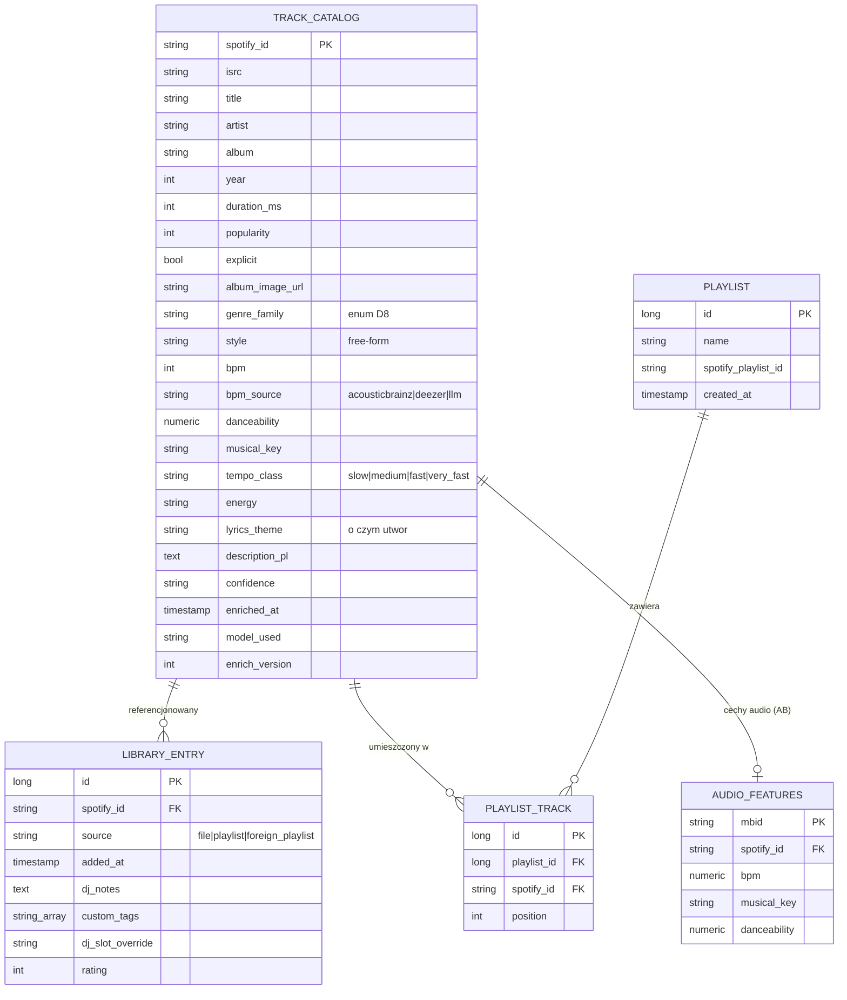
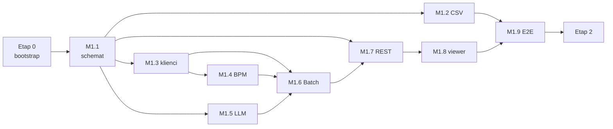

# Plan pracy — rozbicie na etapy i kamienie milowe

Podstawa: [KONCEPT.md](KONCEPT.md) + rozstrzygnięcia z [DECYZJE.md](DECYZJE.md).
Zasada pracy: **jedna sesja Claude Code = jeden kamień milowy** (kamienie są tak krojone,
żeby każdy kończył się działającym, testowalnym przyrostem). Kolejność wymuszona zależnościami —
schemat danych (M1.1) blokuje resztę, bo to jedyna kosztowna rzecz do zmiany (§2.4 konceptu).

---

## Docelowy model danych (uproszczony wg D5)

## Docelowe API (zakres Etapu 1 i 2)

| Obszar | Endpointy | Etap |
|---|---|---|
| Ingestion | `POST /api/ingest/file` (CSV), `GET /api/ingest/jobs/{id}` | 1 |
| Ingestion | `POST /api/ingest/playlist` (URL), `POST /api/ingest/my-playlists` (OAuth) | 2 |
| Playlists | `POST/DELETE /api/playlists/{id}/tracks*`, `PUT /api/playlists/{id}/tracks` (kolejność) | 2 |
| Enrichment | `POST /api/enrich` (scope+fields), `GET /api/enrich/jobs[/{id}]`, `POST /api/enrich/jobs/{id}/restart`, `GET /api/enrich/missing-count` | 1 |
| Catalog | `GET /api/catalog/tracks/{spotifyId}`, `GET /api/catalog/tracks` (search+filtry) | 1 |
| Library | `GET/POST /api/library/tracks`, `PATCH/DELETE /api/library/tracks/{spotifyId}` | 1 |
| Playlists | CRUD `/api/playlists*`, `POST /api/playlists/{id}/export-to-spotify` | 2 |
| Auth Spotify | `GET /api/auth/spotify/login`, `GET /api/auth/spotify/callback`, `GET /api/auth/spotify/status` | 2 |

---

# ETAP 0 — Bootstrap repo (1 sesja)

**Cel:** repo, w którym `mvn verify` przechodzi, a Postgres wstaje jedną komendą.

| # | Zadanie |
|---|---|
| 0.1 | Szkielet Spring Boot 3.x (Java 21, Maven): moduł główny, pakiety `com.pgoogol.{catalog,library,playlist,ingestion,enrichment,api,common}`, `.gitignore`, `.editorconfig` |
| 0.2 | `docker-compose.yml` (Postgres 16) + profile `local`; `.env.example` (SPOTIFY_CLIENT_ID/SECRET, LLM_PROVIDER, LLM_API_KEY, MB_USER_AGENT) |
| 0.3 | `CLAUDE.md` — ruleset Java/Spring (konwencje, komendy build/test, zasady sekretów wg D14) |
| 0.4 | CI GitHub Actions: build + testy na push/PR |

**DoD:** `docker compose up -d` + `mvn verify` działa na czysto sklonowanym repo; CI zielone.

---

# ETAP 1 — Pipeline + baza + viewer (rdzeń, 9 kamieni)

## M1.1 Schemat danych *(blokuje wszystkie pozostałe)*

**Cel:** zamrożony schemat wg diagramu wyżej.

- Encje JPA: `TrackCatalog`, `LibraryEntry`, `Playlist`, `PlaylistTrack`, `AudioFeatures`
- Enumy: `GenreFamily` (D8), `FieldGroup` (METADATA/AUDIO/AI — D11), `EnrichmentScope`
  (SINGLE/SELECTED/MISSING), `TempoClass` (§16.2), `BpmSource` (D6)
- Migracje Flyway `V1__…` + indeksy (pg_trgm na title/artist, GIN tsvector, zakres bpm)
- Repozytoria Spring Data + testy Testcontainers (zapis/odczyt każdej encji, query „missing")

**DoD:** migracje wstają na czystej bazie; testy repozytoriów zielone; schemat zatwierdzony
przed rozpoczęciem M1.2+.

## M1.2 Ingestion tryb A — CSV *(po M1.1)*

**Cel:** import pliku Exportify/własnego CSV do biblioteki.

- Parser CSV (Track/Artist/Album/Spotify URI), walidacja wierszy
- Dedup po `spotify_id`; szkielet rekordu w `track_catalog` + wpis `library_entry` (source=file)
- Raport: `{imported, alreadyExisted, failed[]}`; `POST /api/ingest/file` (multipart)

**DoD:** realny eksport CSV (~2500 wierszy) importuje się < 1 min; ponowny import = 0 nowych;
test integracyjny na próbce pliku.

## M1.3 Klienci źródeł *(po M1.1, równolegle z M1.2)*

**Cel:** komunikacja z zewnętrznymi API — fakty.

- `SpotifyClient` — Client Credentials, pobieranie metadanych/ISRC po `spotify_id` (batch po 50)
- `MusicBrainzClient` — wyłącznie ISRC→MBID; twardy throttle 1 req/s + cache wyników w bazie
- `DeezerClient` — lookup po ISRC (`/track/isrc:…`) i fallback `artist+title`; odczyt pola `bpm`
  (uwaga: `bpm=0` traktować jako brak danych)
- `common/ratelimit`: wspólny limiter + retry z backoff; WireMock w testach

**DoD:** testy jednostkowe na nagranych odpowiedziach (WireMock); smoke-test manualny na
5 realnych utworach; throttle MB potwierdzony w teście.

## M1.4 AudioFeatures + BpmResolver *(po M1.3)*

**Cel:** BPM/danceability/tonacja jako darmowe fakty.

- ETL dumpa AcousticBrainz: skrypt filtrujący dump po MBID-ach biblioteki → tabela
  `audio_features` (jednorazowy, dokumentowany krok; dump nie trafia do repo)
- `BpmResolver` — kaskada D6: `audio_features` (AB) → Deezer → *(brak → zostawia dla AI)*;
  zapis `bpm_source`; sanity-check half-time (latin + BPM<100 → rozważ podwojenie)
- Stub `AudioAnalyzer` (interfejs + implementacja NOOP z TODO) — przyszła analiza previewu

**DoD:** dla próbki ≥50 utworów raport pokrycia: ile z AB, ile z Deezer, ile bez BPM;
testy kaskady (w tym half-time) zielone.

## M1.5 LlmClient + prompt *(po M1.1, równolegle z M1.3/M1.4)*

**Cel:** warstwa AI — estymacje, niezależna od providera (D15).

- `LlmClient` — abstrakcja nad dowolnym providerem LLM (własny interfejs lub Spring AI);
  provider, model i wersja promptu wyłącznie w konfiguracji
- Prompt „ekspert muzyczny i DJ": wejście = metadane (+bpm jeśli znany), wyjście strukturalne:
  `style`, `genre_family`, `lyrics_theme`, `description_pl`, `energy`, `confidence`,
  `bpm_estimate` tylko na wyraźne żądanie (gdy kaskada M1.4 pusta) — z korektą half-time
- Batchowanie po 5 utworów w jednym wywołaniu; parsowanie/walidacja odpowiedzi (JSON)

**DoD:** test na 10 zróżnicowanych utworach (latino/rock/disco polo) — poprawny JSON,
sensowne `genre_family`; koszt na utwór zmierzony i zapisany w PLAN.md (sekcja ryzyk).

## M1.6 Spring Batch job wzbogacania *(po M1.3–M1.5)*

**Cel:** restartowalny pipeline łączący źródła.

- `EnrichmentJobConfig`: reader (utwory wg `scope`) → processor (grupy pól wg `fields`,
  kolejność: METADATA → AUDIO → AI) → writer (zapis inkrementalny do `track_catalog`)
- Chunk=5, checkpointy w tabelach Spring Batch, restart od ostatniego chunku
- `EnrichmentService`: rozwiązywanie zakresu (`missing` = query po NULL-ach wybranych pól),
  start joba, status/postęp

**DoD:** przerwanie joba w trakcie (kill) i restart → dokończenie bez duplikatów; częściowy
postęp widoczny w bazie; testy integracyjne jobów.

## M1.7 REST + Swagger *(po M1.1; pełny zakres po M1.6)*

**Cel:** API odczytu i zleceń wg tabeli wyżej (wiersze Etapu 1).

- Catalog: wyszukiwanie (pg_trgm + tsvector) i filtry: `genreFamily`, `bpmMin/Max`,
  `tempoClass`, `energy`, paginacja
- Library: lista (join z katalogiem), PATCH danych prywatnych (dj_notes, custom_tags, rating,
  dj_slot_override), DELETE
- Enrich: zlecenie, lista jobów, status, restart, missing-count
- springdoc-openapi (Swagger UI pod `/swagger-ui.html`); DTO + mapper w `api`

**DoD:** wszystkie endpointy Etapu 1 wywoływalne ze Swaggera; testy MockMvc/WebTestClient.

## M1.8 Viewer React *(po M1.7)*

**Cel:** minimalny frontend do codziennej pracy.

- Vite + React + TypeScript w `frontend/`; proxy dev na API
- Tabela biblioteki: wyszukiwarka, filtry (genre_family / zakres BPM / szybka-wolna / energia),
  sortowanie, paginacja
- Szczegóły utworu (pełny rekord + edycja uwag DJ / rating / custom tagów)
- Panel wzbogacania: wybór zakresu (zaznaczone / wszystkie brakujące) + grup pól,
  start i podgląd postępu joba

**DoD:** pełny przepływ klikalny: import CSV → przegląd → zlecenie wzbogacenia → odświeżony
widok z BPM/opisami; build frontu w CI.

## M1.9 Walidacja E2E na realnej bibliotece *(po M1.2–M1.8)*

**Cel:** dowód, że Etap 1 jest samodzielnie użyteczny + dane do decyzji o `AudioAnalyzer`.

- Import pełnego CSV (~2500 utworów), wzbogacenie wszystkich grup pól
- **Raport pokrycia per pole i per źródło** (ile BPM z AB / Deezer / LLM; ile braków)
- Pomiar kosztu LLM na całość; poprawki promptu jeśli `genre_family`/style odstają

**DoD:** ≥95% utworów z kompletem pól D5; raport pokrycia zapisany w `docs/`; decyzja
„czy potrzebny AudioAnalyzer" podjęta i dopisana do DECYZJE.md.

---

# ETAP 2 — Integracja Spotify + playlisty (etap końcowy) ✅

| Kamień | Zakres | Zależy od | Stan |
|---|---|---|---|
| **M2.1** Ingestion B/D | Import playlisty po URL (własnej/publicznej): `playlist_tracks` + paginacja, dedup, raport | M1.2, M1.3 | ✅ |
| **M2.2** OAuth PKCE + tryb C | Połączenie konta właściciela, import wszystkich własnych playlist, odświeżanie tokenów | M2.1 | ✅ |
| **M2.3** Playlisty + planowanie setów | CRUD playlist, kolejność utworów (drag&drop we froncie), `dj_slot` liczony z bpm+energy+genre_family (D9) z override | M1.7, M1.8 | ✅ |
| **M2.4** Eksport na Spotify | Utworzenie playlisty na koncie + dodanie utworów (batch po 100 URI) | M2.2, M2.3 | ✅ |
| **M2.5** (opcjonalnie) Deployment | Neon + Railway/Fly.io + Vercel; dla narzędzia osobistego lokalny docker-compose też wystarcza | Etap 1 | 📄 [DEPLOYMENT.md](DEPLOYMENT.md) |

**DoD Etapu 2:** planowanie setu od importu playlisty do eksportu gotowego setu na Spotify
bez wychodzenia z aplikacji — **spełnione**; przebieg krok po kroku:
[M2_RUNBOOK.md](M2_RUNBOOK.md). Rozstrzygnięcia etapu: D20 (konto Spotify w bazie,
tokeny server-side) i D21 (enum `DjSlot`, kaskada slotów, kontrakt kolejności setu).

M2.5 celowo zostaje na poziomie dokumentacji: dla narzędzia jednego DJ-a lokalny
`docker compose` wystarcza, a publiczny hosting aplikacji bez auth (D2/D14) wymagałby
najpierw postawienia przed nią bramki na hasło — decyzja właściciela, nie kamień do
odhaczenia.

---

# ETAP 3 — Dopracowanie narzędzia (po zamknięciu Etapu 2)

| Kamień | Zakres | Zależy od | Stan |
|---|---|---|---|
| **M3.1** Rozbudowa UI | Zakładki (Biblioteka / Sety / Import / Wzbogacanie), stan widoku w adresie, sortowanie serwerowe katalogu, statystyki i ostrzeżenia setu, historia jobów, testy frontu w CI | M1.8, M2.3 | ✅ |
| **M3.2** Motyw „konsola" i przegląd playlist | Retro-futurystyczny motyw UI, filtry biblioteczne w wyszukiwarce (`inLibrary`/`ratingMin`/`tag`), widok Playlisty z wejściem do środka (szukanie, krzywa tempa, zwijane sekcje), import własnych playlist z podsumowaniem w modalu, import z pliku znika z UI | M3.1 | ✅ |

**M3.1 w skrócie** (rozstrzygnięcia: [D22](DECYZJE.md)):

- **Biblioteka:** okładki i czas trwania w tabeli, znacznik „do wzbogacenia",
  sortowanie liczone przez bazę (`sort` + `direction` w `GET /api/catalog/tracks`,
  biała lista kolumn, braki zawsze na końcu), rozmiar strony, filtry i strona
  zapisane w hashu — odświeżenie wraca do tego samego widoku.
- **Utwór:** okładka, link do Spotify, ocena gwiazdkami, tagi jako chipsy,
  slot wieczoru z listy wartości `DjSlot` zamiast wolnego tekstu.
- **Sety:** statystyki (liczba utworów, czas, zakres i średnia BPM), rozkład faz
  wieczoru, krzywa tempa, ostrzeżenia (skok > 15 BPM, utwór bez BPM, cofnięcie
  fazy), układanie wg faz D9 jednym kliknięciem, kolejność zmieniana przeciąganiem
  albo strzałkami (dostępność z klawiatury).
- **Wzbogacanie:** pokrycie pól D11 na paskach, historia jobów z restartem
  nieudanych — postęp przestaje znikać po odświeżeniu strony.
- **Jakość:** wspólny host powiadomień (błąd API nie ginie przy zmianie widoku),
  testy Vitest + Testing Library uruchamiane w CI (`npm test`).

**DoD:** `./mvnw verify` i `npm test && npm run build` zielone; pełny przepływ
(import → przegląd → wzbogacenie → set → eksport) klikalny bez wychodzenia
z aplikacji i odtwarzalny z adresu.

**M3.2 w skrócie** (rozstrzygnięcia: [D23](DECYZJE.md)):

- **Motyw „konsola" (retro-futuryzm):** bursztynowy CRT i cyjan na granatowej
  czerni, moduły ze ściętym narożnikiem, pigułkowe formanty, chromowany napis
  marki, linie kineskopu, krzywa tempa z poświatą luminoforu. Wersaliki i font
  o stałej szerokości tylko w nagłówkach i liczbach — tytuły w tabeli zostają
  w foncie systemowym, bo 2500 utworów ma być czytelne.
- **Wyszukiwarka filtruje też po bibliotece:** `inLibrary` (tylko w bibliotece /
  tylko spoza), `ratingMin`, `tag` w `GET /api/catalog/tracks`; słownik tagów
  z `GET /api/library/tags` podpowiada wartości. Filtry siedzą w adresie
  (`lib`, `rating`, `tag`) jak reszta stanu widoku.
- **Nowa zakładka Playlisty:** kafle wszystkich playlist (import ze Spotify +
  sety z planera) z szukaniem po nazwie, a po wejściu do środka: szukanie po
  utworach, krzywa tempa i zwijane sekcje faz wieczoru; z podglądu jedno
  kliknięcie prowadzi do planera setów.
- **Import własnych playlist kończy się modalem** z raportem per playlista —
  operacja trwa (playlista po playliście), więc podsumowania nie wolno powierzać
  znikającemu toastowi.
- **Import z pliku CSV zniknął z UI** (endpoint `/api/ingest/file` został w API).

**DoD:** `./mvnw verify` i `npm test && npm run build` zielone; import własnych
playlist, przegląd playlisty i filtrowanie biblioteki klikalne bez wychodzenia
z aplikacji.

---

# ETAP 4 — Wzbogacanie v2 (przeprojektowane)

**Cel:** katalog, w którym o każdym polu wiadomo, skąd pochodzi i na ile jest
pewne — zamiast kaskady, w której ostatni zapis wygrywa, a 24% BPM to zgadywanka
modelu. Projekt: [WZBOGACANIE_V2.md](WZBOGACANIE_V2.md), rozstrzygnięcia:
[D24](DECYZJE.md).

| Kamień | Zakres | Zależy od | Stan |
|---|---|---|---|
| **M4.1** Obserwacje i rozstrzyganie *(blokuje resztę)* | migracja V5 (`track_observation`, `track_field_resolution`), enumy `Field`/`Tier`/`ProviderId`, `FieldResolver` z wersjonowaną polityką, backfill z obecnych kolumn, przeliczanie bez sieci | M1.6 | 📄 |
| **M4.2** SPI dostawców + planner | `EnrichmentProvider`, przepisanie Spotify/AB/MB/Deezer/LLM na dostawców, planner par (utwór, pole) z budżetem, job na plannerze; `TrackEnricher` i `BpmResolver` znikają | M4.1 | 📄 |
| **M4.3** Żniwa z istniejących źródeł | ETL dumpa AB **high-level**, pełne MusicBrainz, pełny Deezer, `genres[]` artysty ze Spotify, **pomiar pokrycia przed/po** | M4.2 | 📄 |
| **M4.4** Discogs + nowe pola | dostawca Discogs (genre/style), `lyrics_language`, `first_release_year`, `canonical_recording_id`, dedup wersji nagrania | M4.2 | 📄 |
| **M4.5** Prompt v2 | LLM jako konsolidator: wejście = zebrane fakty, wyjście bez liczb, `confidence` per pole; `bpm_estimate` usunięte z kontraktu | M4.3, M4.4 | 📄 |
| **M4.6** UI uczciwych braków | „niezmierzone" zamiast pustki, znacznik pochodzenia per pole, pokrycie per pole/źródło, kolejka „spornych", przerwa w krzywej tempa | M4.5 | 📄 |

Kolejność wymuszona: M4.1 blokuje wszystko (jak M1.1 w Etapie 1); M4.3 ∥ M4.4.

**DoD Etapu 4:** dla dowolnego utworu widać pochodzenie każdego pola (zmierzone /
deklarowane / wywnioskowane); zmiana polityki rozstrzygania przelicza katalog bez
ruchu sieciowego; żadna liczba w katalogu nie pochodzi z modelu językowego; raport
pokrycia przed/po zapisany w `docs/`.

---

# Zależności między kamieniami

Równolegle da się prowadzić: M1.2 ∥ M1.3 ∥ M1.5 (wspólna zależność tylko od M1.1).

# Ryzyka i mitygacje

| Ryzyko | Wpływ | Mitygacja |
|---|---|---|
| Pokrycie BPM: Deezer `bpm=0`, dump AB zamrożony 2022 | brak BPM dla części nowych utworów | kaskada 3 źródeł + fallback LLM; raport pokrycia w M1.9; w odwodzie stub `AudioAnalyzer` (analiza previewu) |
| MusicBrainz 1 req/s | wolne pierwsze wzbogacanie (~2500 utworów ≈ 40+ min samego MB) | cache trwały w bazie; MB potrzebny tylko do MBID; job w tle, restartowalny |
| Rozmiar dumpa AcousticBrainz | ETL niewygodny lokalnie | filtrowanie strumieniowe po MBID; dump poza repo; krok udokumentowany, jednorazowy |
| Koszt LLM | przekroczenie budżetu | tani model klasy „mini/haiku", batch po 5, katalog deduplikuje, selektywne pola; pomiar kosztu w M1.5/M1.9 |

**Pomiar kosztu LLM (M1.5):** mechanizm gotowy — `LlmSmokeTest` raportuje tokeny
i koszt/utwór (`MV_SMOKE=true LLM_API_KEY=… LLM_MODEL=… ./mvnw test -Dtest=LlmSmokeTest`,
stawki przez `LLM_COST_INPUT_PER_1M`/`LLM_COST_OUTPUT_PER_1M`). Szacunek dla promptu v1
(batch po 5): ~150 tokenów wejścia + ~120 wyjścia na utwór → dla modelu klasy
mini/haiku (~$1/M in, ~$5/M out) **≈ $0.0008/utwór, cała biblioteka ~2500 utworów ≈ $2**.
Realny pomiar do wpisania tutaj po pierwszym uruchomieniu z kluczem providera
(sieć środowiska deweloperskiego blokuje zewnętrzne API). **Próba generalna M1.9
(2500 utworów, stub providera):** 140 tokenów wej. + 120 wyj. na utwór →
≈ $0.00074/utwór, biblioteka ~2500 utworów ≈ **$1.85** (stawki klasy mini/haiku).
| Dryf schematu po M1.1 | kosztowne migracje | schemat zatwierdzany explicit przed M1.2+; zmiany tylko przez Flyway |
| Limity/zmiany API Spotify (por. martwe preview_url) | tryby B/C/D | izolacja w `SpotifyClient`; tryb A (CSV) zawsze działa jako fallback |
