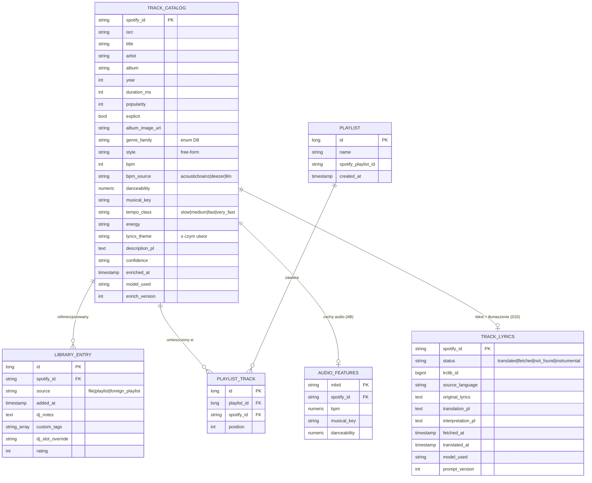
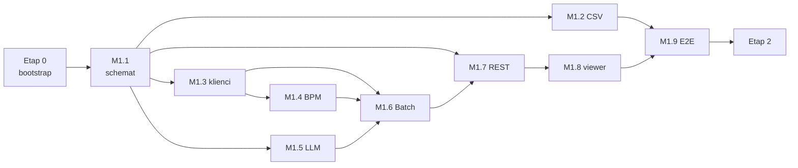
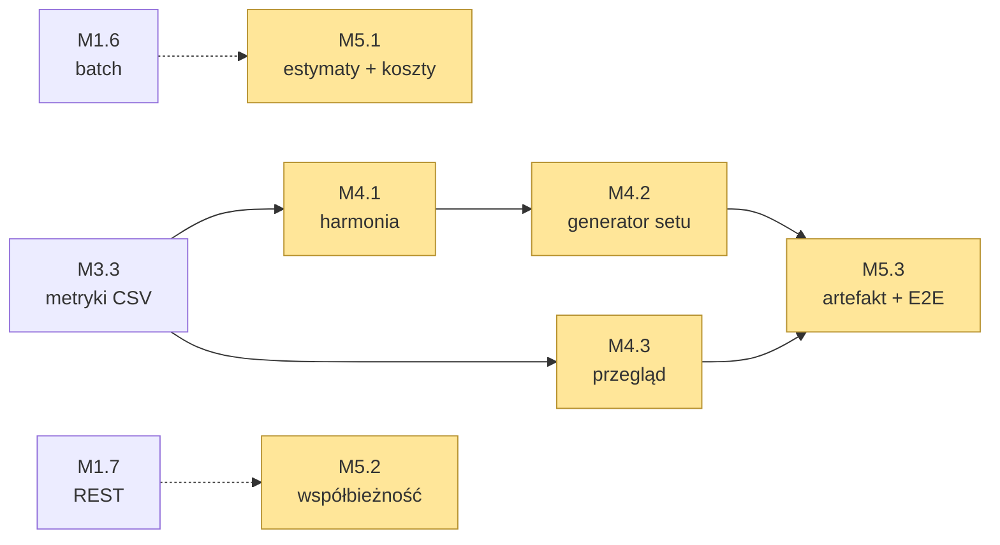

# Plan pracy — rozbicie na etapy i kamienie milowe

Podstawa: [KONCEPT.md](KONCEPT.md) + rozstrzygnięcia z [DECYZJE.md](DECYZJE.md).
Zasada pracy: **jedna sesja Claude Code = jeden kamień milowy** (kamienie są tak krojone,
żeby każdy kończył się działającym, testowalnym przyrostem). Kolejność wymuszona zależnościami —
schemat danych (M1.1) blokuje resztę, bo to jedyna kosztowna rzecz do zmiany (§2.4 konceptu).

---

## Docelowy model danych (uproszczony wg D5)

## Docelowe API (zakres Etapu 1 i 2)

| Obszar | Endpointy | Etap |
|---|---|---|
| Ingestion | `POST /api/ingest/file` (CSV), `GET /api/ingest/jobs/{id}` | 1 |
| Ingestion | `POST /api/ingest/playlist` (URL), `POST /api/ingest/my-playlists` (OAuth) | 2 |
| Playlists | `POST/DELETE /api/playlists/{id}/tracks*`, `PUT /api/playlists/{id}/tracks` (kolejność) | 2 |
| Enrichment | `POST /api/enrich` (scope+fields), `GET /api/enrich/jobs[/{id}]`, `POST /api/enrich/jobs/{id}/restart`, `GET /api/enrich/missing-count` | 1 |
| Catalog | `GET /api/catalog/tracks/{spotifyId}`, `GET /api/catalog/tracks` (search+filtry) | 1 |
| Catalog | `GET /api/catalog/tracks/{spotifyId}/lyrics` (tekst + tłumaczenie, D32) | 6 |
| Library | `GET/POST /api/library/tracks`, `PATCH/DELETE /api/library/tracks/{spotifyId}` | 1 |
| Playlists | CRUD `/api/playlists*`, `POST /api/playlists/{id}/export-to-spotify` | 2 |
| Auth Spotify | `GET /api/auth/spotify/login`, `GET /api/auth/spotify/callback`, `GET /api/auth/spotify/status` | 2 |

---

# ETAP 0 — Bootstrap repo (1 sesja)

**Cel:** repo, w którym `mvn verify` przechodzi, a Postgres wstaje jedną komendą.

| # | Zadanie |
|---|---|
| 0.1 | Szkielet Spring Boot 3.x (Java 21, Maven): moduł główny, pakiety `com.pgoogol.{catalog,library,playlist,ingestion,enrichment,api,common}`, `.gitignore`, `.editorconfig` |
| 0.2 | `docker-compose.yml` (Postgres 16) + profile `local`; `.env.example` (SPOTIFY_CLIENT_ID/SECRET, LLM_PROVIDER, LLM_API_KEY, MB_USER_AGENT) |
| 0.3 | `CLAUDE.md` — ruleset Java/Spring (konwencje, komendy build/test, zasady sekretów wg D14) |
| 0.4 | CI GitHub Actions: build + testy na push/PR |

**DoD:** `docker compose up -d` + `mvn verify` działa na czysto sklonowanym repo; CI zielone.

---

# ETAP 1 — Pipeline + baza + viewer (rdzeń, 9 kamieni)

## M1.1 Schemat danych *(blokuje wszystkie pozostałe)*

**Cel:** zamrożony schemat wg diagramu wyżej.

- Encje JPA: `TrackCatalog`, `LibraryEntry`, `Playlist`, `PlaylistTrack`, `AudioFeatures`
- Enumy: `GenreFamily` (D8), `FieldGroup` (METADATA/AUDIO/AI — D11), `EnrichmentScope`
  (SINGLE/SELECTED/MISSING), `TempoClass` (§16.2), `BpmSource` (D6)
- Migracje Flyway `V1__…` + indeksy (pg_trgm na title/artist, GIN tsvector, zakres bpm)
- Repozytoria Spring Data + testy Testcontainers (zapis/odczyt każdej encji, query „missing")

**DoD:** migracje wstają na czystej bazie; testy repozytoriów zielone; schemat zatwierdzony
przed rozpoczęciem M1.2+.

## M1.2 Ingestion tryb A — CSV *(po M1.1)*

**Cel:** import pliku Exportify/własnego CSV do biblioteki.

- Parser CSV (Track/Artist/Album/Spotify URI), walidacja wierszy
- Dedup po `spotify_id`; szkielet rekordu w `track_catalog` + wpis `library_entry` (source=file)
- Raport: `{imported, alreadyExisted, failed[]}`; `POST /api/ingest/file` (multipart)

**DoD:** realny eksport CSV (~2500 wierszy) importuje się < 1 min; ponowny import = 0 nowych;
test integracyjny na próbce pliku.

## M1.3 Klienci źródeł *(po M1.1, równolegle z M1.2)*

**Cel:** komunikacja z zewnętrznymi API — fakty.

- `SpotifyClient` — Client Credentials, pobieranie metadanych/ISRC po `spotify_id` (batch po 50)
- `MusicBrainzClient` — wyłącznie ISRC→MBID; twardy throttle 1 req/s + cache wyników w bazie
- `DeezerClient` — lookup po ISRC (`/track/isrc:…`) i fallback `artist+title`; odczyt pola `bpm`
  (uwaga: `bpm=0` traktować jako brak danych)
- `common/ratelimit`: wspólny limiter + retry z backoff; WireMock w testach

**DoD:** testy jednostkowe na nagranych odpowiedziach (WireMock); smoke-test manualny na
5 realnych utworach; throttle MB potwierdzony w teście.

## M1.4 AudioFeatures + BpmResolver *(po M1.3)*

**Cel:** BPM/danceability/tonacja jako darmowe fakty.

- ETL dumpa AcousticBrainz: skrypt filtrujący dump po MBID-ach biblioteki → tabela
  `audio_features` (jednorazowy, dokumentowany krok; dump nie trafia do repo)
- `BpmResolver` — kaskada D6: `audio_features` (AB) → Deezer → *(brak → zostawia dla AI)*;
  zapis `bpm_source`; sanity-check half-time (latin + BPM<100 → rozważ podwojenie)
- Stub `AudioAnalyzer` (interfejs + implementacja NOOP z TODO) — przyszła analiza previewu

**DoD:** dla próbki ≥50 utworów raport pokrycia: ile z AB, ile z Deezer, ile bez BPM;
testy kaskady (w tym half-time) zielone.

## M1.5 LlmClient + prompt *(po M1.1, równolegle z M1.3/M1.4)*

**Cel:** warstwa AI — estymacje, niezależna od providera (D15).

- `LlmClient` — abstrakcja nad dowolnym providerem LLM (własny interfejs lub Spring AI);
  provider, model i wersja promptu wyłącznie w konfiguracji
- Prompt „ekspert muzyczny i DJ": wejście = metadane (+bpm jeśli znany), wyjście strukturalne:
  `style`, `genre_family`, `lyrics_theme`, `description_pl`, `energy`, `confidence`,
  `bpm_estimate` tylko na wyraźne żądanie (gdy kaskada M1.4 pusta) — z korektą half-time
- Batchowanie po 5 utworów w jednym wywołaniu; parsowanie/walidacja odpowiedzi (JSON)

**DoD:** test na 10 zróżnicowanych utworach (latino/rock/disco polo) — poprawny JSON,
sensowne `genre_family`; koszt na utwór zmierzony i zapisany w PLAN.md (sekcja ryzyk).

## M1.6 Spring Batch job wzbogacania *(po M1.3–M1.5)*

**Cel:** restartowalny pipeline łączący źródła.

- `EnrichmentJobConfig`: reader (utwory wg `scope`) → processor (grupy pól wg `fields`,
  kolejność: METADATA → AUDIO → AI) → writer (zapis inkrementalny do `track_catalog`)
- Chunk=5, checkpointy w tabelach Spring Batch, restart od ostatniego chunku
- `EnrichmentService`: rozwiązywanie zakresu (`missing` = query po NULL-ach wybranych pól),
  start joba, status/postęp

**DoD:** przerwanie joba w trakcie (kill) i restart → dokończenie bez duplikatów; częściowy
postęp widoczny w bazie; testy integracyjne jobów.

## M1.7 REST + Swagger *(po M1.1; pełny zakres po M1.6)*

**Cel:** API odczytu i zleceń wg tabeli wyżej (wiersze Etapu 1).

- Catalog: wyszukiwanie (pg_trgm + tsvector) i filtry: `genreFamily`, `bpmMin/Max`,
  `tempoClass`, `energy`, paginacja
- Library: lista (join z katalogiem), PATCH danych prywatnych (dj_notes, custom_tags, rating,
  dj_slot_override), DELETE
- Enrich: zlecenie, lista jobów, status, restart, missing-count
- springdoc-openapi (Swagger UI pod `/swagger-ui.html`); DTO + mapper w `api`

**DoD:** wszystkie endpointy Etapu 1 wywoływalne ze Swaggera; testy MockMvc/WebTestClient.

## M1.8 Viewer React *(po M1.7)*

**Cel:** minimalny frontend do codziennej pracy.

- Vite + React + TypeScript w `frontend/`; proxy dev na API
- Tabela biblioteki: wyszukiwarka, filtry (genre_family / zakres BPM / szybka-wolna / energia),
  sortowanie, paginacja
- Szczegóły utworu (pełny rekord + edycja uwag DJ / rating / custom tagów)
- Panel wzbogacania: wybór zakresu (zaznaczone / wszystkie brakujące) + grup pól,
  start i podgląd postępu joba

**DoD:** pełny przepływ klikalny: import CSV → przegląd → zlecenie wzbogacenia → odświeżony
widok z BPM/opisami; build frontu w CI.

## M1.9 Walidacja E2E na realnej bibliotece *(po M1.2–M1.8)*

**Cel:** dowód, że Etap 1 jest samodzielnie użyteczny + dane do decyzji o `AudioAnalyzer`.

- Import pełnego CSV (~2500 utworów), wzbogacenie wszystkich grup pól
- **Raport pokrycia per pole i per źródło** (ile BPM z AB / Deezer / LLM; ile braków)
- Pomiar kosztu LLM na całość; poprawki promptu jeśli `genre_family`/style odstają

**DoD:** ≥95% utworów z kompletem pól D5; raport pokrycia zapisany w `docs/`; decyzja
„czy potrzebny AudioAnalyzer" podjęta i dopisana do DECYZJE.md.

---

# ETAP 2 — Integracja Spotify + playlisty (etap końcowy) ✅

| Kamień | Zakres | Zależy od | Stan |
|---|---|---|---|
| **M2.1** Ingestion B/D | Import playlisty po URL (własnej/publicznej): `playlist_tracks` + paginacja, dedup, raport | M1.2, M1.3 | ✅ |
| **M2.2** OAuth PKCE + tryb C | Połączenie konta właściciela, import wszystkich własnych playlist, odświeżanie tokenów | M2.1 | ✅ |
| **M2.3** Playlisty + planowanie setów | CRUD playlist, kolejność utworów (drag&drop we froncie), `dj_slot` liczony z bpm+energy+genre_family (D9) z override | M1.7, M1.8 | ✅ |
| **M2.4** Eksport na Spotify | Utworzenie playlisty na koncie + dodanie utworów (batch po 100 URI) | M2.2, M2.3 | ✅ |
| **M2.5** (opcjonalnie) Deployment | Neon + Railway/Fly.io + Vercel; dla narzędzia osobistego lokalny docker-compose też wystarcza | Etap 1 | 📄 [DEPLOYMENT.md](DEPLOYMENT.md) |

**DoD Etapu 2:** planowanie setu od importu playlisty do eksportu gotowego setu na Spotify
bez wychodzenia z aplikacji — **spełnione**; przebieg krok po kroku:
[M2_RUNBOOK.md](M2_RUNBOOK.md). Rozstrzygnięcia etapu: D20 (konto Spotify w bazie,
tokeny server-side) i D21 (enum `DjSlot`, kaskada slotów, kontrakt kolejności setu).

M2.5 celowo zostaje na poziomie dokumentacji: dla narzędzia jednego DJ-a lokalny
`docker compose` wystarcza, a publiczny hosting aplikacji bez auth (D2/D14) wymagałby
najpierw postawienia przed nią bramki na hasło — decyzja właściciela, nie kamień do
odhaczenia.

---

# ETAP 3 — Dopracowanie narzędzia (po zamknięciu Etapu 2)

| Kamień | Zakres | Zależy od | Stan |
|---|---|---|---|
| **M3.1** Rozbudowa UI | Zakładki (Biblioteka / Sety / Import / Wzbogacanie), stan widoku w adresie, sortowanie serwerowe katalogu, statystyki i ostrzeżenia setu, historia jobów, testy frontu w CI | M1.8, M2.3 | ✅ |
| **M3.2** Motyw „konsola" i przegląd playlist | Retro-futurystyczny motyw UI, filtry biblioteczne w wyszukiwarce (`inLibrary`/`ratingMin`/`tag`), widok Playlisty z wejściem do środka (szukanie, krzywa tempa, zwijane sekcje), import własnych playlist z podsumowaniem w modalu, import z pliku znika z UI | M3.1 | ✅ |
| **M3.3** Metryki z pliku CSV | Tabela `manual_metrics` (V5), parser i import `POST /api/ingest/metrics` (dopasowanie po `spotify_id`, awaryjnie po ISRC), `BpmSource.MANUAL` na czele kaskady D6, zmierzona energia zamiast estymaty LLM, `genre_family` z kolumn z gatunkami (tylko gdy pusty), panel w zakładce Import i podgląd w szufladzie utworu | M1.4, M1.6, M3.2 | ✅ |

**M3.3 w skrócie** (rozstrzygnięcia: [D24](DECYZJE.md), format pliku:
[METRYKI_CSV.md](METRYKI_CSV.md)): po wyłączeniu `audio-features` przez Spotify
(27.11.2024) cechy audio wgrywamy tymczasowo ręcznie — plik CSV uzupełnia utwory,
które są już w katalogu, a jego wartości są surowo zapisywane w `manual_metrics`
i rzutowane na katalog (BPM z korektą half-time, tonacja, danceability, energia).
Wzbogacanie AI zostaje bez zmian; job nie nadpisuje zmierzonej energii estymatą.
Z kolumn z gatunkami wypełniamy `genre_family`, gdy utwór jeszcze go nie ma — bez niej
nie ma slotu wieczoru ani korekty half-time (przy okazji naprawiony NPE w `DjSlotCalculator`
dla utworu bez gatunku).

**M3.1 w skrócie** (rozstrzygnięcia: [D22](DECYZJE.md)):

- **Biblioteka:** okładki i czas trwania w tabeli, znacznik „do wzbogacenia",
  sortowanie liczone przez bazę (`sort` + `direction` w `GET /api/catalog/tracks`,
  biała lista kolumn, braki zawsze na końcu), rozmiar strony, filtry i strona
  zapisane w hashu — odświeżenie wraca do tego samego widoku.
- **Utwór:** okładka, link do Spotify, ocena gwiazdkami, tagi jako chipsy,
  slot wieczoru z listy wartości `DjSlot` zamiast wolnego tekstu.
- **Sety:** statystyki (liczba utworów, czas, zakres i średnia BPM), rozkład faz
  wieczoru, krzywa tempa, ostrzeżenia (skok > 15 BPM, utwór bez BPM, cofnięcie
  fazy), układanie wg faz D9 jednym kliknięciem, kolejność zmieniana przeciąganiem
  albo strzałkami (dostępność z klawiatury).
- **Wzbogacanie:** pokrycie pól D11 na paskach, historia jobów z restartem
  nieudanych — postęp przestaje znikać po odświeżeniu strony.
- **Jakość:** wspólny host powiadomień (błąd API nie ginie przy zmianie widoku),
  testy Vitest + Testing Library uruchamiane w CI (`npm test`).

**DoD:** `./mvnw verify` i `npm test && npm run build` zielone; pełny przepływ
(import → przegląd → wzbogacenie → set → eksport) klikalny bez wychodzenia
z aplikacji i odtwarzalny z adresu.

**M3.2 w skrócie** (rozstrzygnięcia: [D23](DECYZJE.md)):

- **Motyw „konsola" (retro-futuryzm):** bursztynowy CRT i cyjan na granatowej
  czerni, moduły ze ściętym narożnikiem, pigułkowe formanty, chromowany napis
  marki, linie kineskopu, krzywa tempa z poświatą luminoforu. Wersaliki i font
  o stałej szerokości tylko w nagłówkach i liczbach — tytuły w tabeli zostają
  w foncie systemowym, bo 2500 utworów ma być czytelne.
- **Wyszukiwarka filtruje też po bibliotece:** `inLibrary` (tylko w bibliotece /
  tylko spoza), `ratingMin`, `tag` w `GET /api/catalog/tracks`; słownik tagów
  z `GET /api/library/tags` podpowiada wartości. Filtry siedzą w adresie
  (`lib`, `rating`, `tag`) jak reszta stanu widoku.
- **Nowa zakładka Playlisty:** kafle wszystkich playlist (import ze Spotify +
  sety z planera) z szukaniem po nazwie, a po wejściu do środka: szukanie po
  utworach, krzywa tempa i zwijane sekcje faz wieczoru; z podglądu jedno
  kliknięcie prowadzi do planera setów.
- **Import własnych playlist kończy się modalem** z raportem per playlista —
  operacja trwa (playlista po playliście), więc podsumowania nie wolno powierzać
  znikającemu toastowi.
- **Import z pliku CSV zniknął z UI** (endpoint `/api/ingest/file` został w API).

**DoD:** `./mvnw verify` i `npm test && npm run build` zielone; import własnych
playlist, przegląd playlisty i filtrowanie biblioteki klikalne bez wychodzenia
z aplikacji.

---

# ETAP 4 — Warsztat DJ-a (zaplanowany)

**Cel etapu:** aplikacja przestaje być katalogiem, a zaczyna podpowiadać, **co z czym
zagrać**. Wszystkie trzy kamienie stoją na danych, które już są w bazie — żaden nie
wymaga nowego źródła zewnętrznego ani migracji schematu domenowego.

| Kamień | Zakres | Zależy od | Stan |
|---|---|---|---|
| **M4.1** Zgodność harmoniczna i pełne metryki | Camelot liczony z `musical_key`, filtry harmoniczne w wyszukiwarce, filtry `valence`/`instrumentalness`/`liveness`, ostrzeżenia tonacji/głośności/metrum w secie (D25) | M3.3 | ✅ |
| **M4.2** Generator setu | `POST /api/sets/propose` — propozycja setu na zadany czas z ograniczeniami (fazy D9, skok BPM, harmonia, odstęp między utworami wykonawcy), podgląd przed zapisem (D26) | M4.1 | ✅ |
| **M4.3** Przegląd biblioteki | Zakładka „Przegląd": rozkłady gatunków / BPM / energii, udział źródeł BPM, pokrycie pól, top wykonawcy, przyrost biblioteki; agregaty liczy baza (D27) | M3.3 | ✅ |

## M4.1 Zgodność harmoniczna i pełne metryki *(po M3.3)*

**Cel:** DJ widzi, co pasuje tonacyjnie, i filtruje po cechach, które już leżą w bazie
i do tej pory służyły wyłącznie do oglądania.

- `CamelotKey` w module `catalog` — bijekcja `musical_key` ↔ 24 pozycje koła
  (1A–12A moll, 1B–12B dur); parser przyjmuje obie notacje enharmoniczne
  („D# minor" = „Eb minor"). Camelot jest **wyliczany, nie zapisywany** (D25), tak jak
  `dj_slot` (D9)
- `GET /api/catalog/tracks` dostaje `camelot` (dopasowanie dokładne) i `camelotCompatible`
  (rozszerza do zbioru zgodnych: ten sam klucz, ±1 na kole, względna dur/moll); filtr
  tłumaczy się na `musical_key in (…)` — bez dodatkowego złączenia i bez zmiany planu zapytania
- `camelot` w `TrackResponse` i `PlaylistTrackResponse` jako pole wyliczane (jak `djSlot`)
- Filtry z `manual_metrics` przez `left join` (wzorzec D23): `valenceMin/Max`,
  `instrumentalMin`, `livenessMax`; UI pokazuje licznik „X z Y utworów ma metryki",
  bo filtr działa tylko dla utworów z wgranego pliku
- `setPlanner.ts`: ostrzeżenia `KEY_CLASH` (sąsiedzi niezgodni harmonicznie),
  `LOUDNESS_JUMP` (> 3 dB) i `ODD_METER` (metrum ≠ 4/4) obok istniejącego `BPM_JUMP`
- **Bez sortowania po metrykach** — ten sam argument co przy ocenie w D23: kolumny nie ma
  w tabeli, więc porządek byłby dla DJ-a niewidoczny

**DoD:** zaznaczenie utworu i włączenie „pasujące tonacyjnie" zawęża listę do zgodnych;
set z celowo zderzonymi tonacjami pokazuje ostrzeżenia; testy jednostkowe koła
(24 tonacje × zbiór zgodnych, obie notacje enharmoniczne) i testy integracyjne filtrów zielone.

## M4.2 Generator setu *(po M4.1)*

**Cel:** „ułóż mi cztery godziny z tego, co mam" — jako propozycja do poprawienia,
nie jako fakt dokonany.

- `SetGenerator` w module `playlist`: wejście = docelowy czas, filtry katalogu (te same
  co w wyszukiwarce), minimalna ocena; wyjście = lista utworów w kolejności + ostrzeżenia
- Podział czasu na fazy D9 wg krzywej wieczoru (WARMUP 25% / MIDDLE 30% / PEAK 30% /
  CLOSING 15%), w każdej fazie wybór zachłanny z oknem
- Ograniczenia **twarde** (zawężają pulę): utwór raz w secie, ten sam wykonawca nie
  częściej niż raz na 30 minut. **Miękkie** (kary w ocenie kandydata): skok BPM > 15,
  brak zgodności harmonicznej (M4.1), niska ocena, brak BPM
- `POST /api/sets/propose` **niczego nie zapisuje** — front pokazuje podgląd, a zapis idzie
  istniejącą drogą (`POST /api/playlists` + `POST /{id}/tracks`); generator zostaje
  bezstanowy i nie dubluje CRUD-a z M2.3
- Powtarzalność: wybór spośród pięciu najlepszych kandydatów z ziarnem z żądania —
  podany `seed` daje ten sam set, brak `seed` daje inną propozycję za każdym razem (D26)

**DoD:** generator układa 4-godzinny set z realnej biblioteki bez naruszenia ograniczeń
twardych, a krzywa tempa rośnie do szczytu i opada; testy jednostkowe każdego ograniczenia
osobno; przy zbyt wąskich filtrach zwraca krótszy set z jawnym powodem, nie błąd.

## M4.3 Przegląd biblioteki *(po M3.3)*

**Cel:** ekran odpowiadający na pytanie „co ja właściwie mam" — pięć obecnych zakładek
jest operacyjnych, żadna nie pokazuje biblioteki z góry.

- `GET /api/library/overview` — jedno wywołanie, agregaty liczone w bazie
  (`count(*) filter`, `width_bucket` na BPM); front nie ściąga 2500 wierszy po to,
  żeby je zliczyć
- Zawartość: liczby katalog / biblioteka, rozkład `genre_family`, histogram BPM
  w koszykach po 10, rozkłady `tempo_class` i `energy`, **udział `bpm_source`**
  (ile biblioteki to fakt, ile estymata LLM — wskaźnik z kryterium D19 podany na bieżąco),
  pokrycie grup pól D11, top 10 wykonawców, rozkład ocen, przyrost biblioteki po miesiącach
  z `library_entry.added_at`
- Nowa zakładka „Przegląd" jako pierwsza w `ROUTES`; wykresy rysowane inline w SVG,
  jak `BpmCurve` — bez biblioteki wykresów i bez zasobów z sieci (D22/D23)
- `GET /api/enrich/missing-count` liczy się jednym zapytaniem zamiast trzech (D27)

**DoD:** ekran ładuje się bez zauważalnej zwłoki na bibliotece 2500 utworów; każda liczba
na ekranie daje się odtworzyć zapytaniem w duchu `scripts/coverage_report.sql`; testy
repozytorium na Testcontainers dla każdego agregatu.

---

# ETAP 5 — Dojrzałość narzędzia (zaplanowany)

**Cel etapu:** domknięcie rzeczy, które w Etapach 1–3 zostały świadomie odłożone albo
wyszły dopiero w użyciu. Kamienie są **wzajemnie niezależne** i można je brać
w dowolnej kolejności — z jednym wyjątkiem: M5.3 warto zostawić na koniec, żeby test E2E
pokrywał już docelowy zestaw ekranów. Rekomendowana kolejność startowa to M5.1, bo
jako jedyny chroni portfel.

| Kamień | Zakres | Zależy od | Stan |
|---|---|---|---|
| **M5.1** Przeliczanie estymat i koszty | `EnrichmentScope.OUTDATED`, szacunek kosztu przed startem joba, twardy limit utworów, historia jobów jednym zapytaniem (D28) | M1.6 | 📋 |
| **M5.2** Spójność zapisu współbieżnego | `@Version` na `library_entry` i `playlist`, `409 RESOURCE_MODIFIED`, obsługa konfliktu we froncie (D29) | M1.7 | ✅ |
| **M5.3** Dwie aplikacje + testy E2E | Osobne obrazy backendu i frontu (nginx z proxy `/api`), obie usługi w docker-compose, Playwright na pełnym przepływie (D30) | Etap 4 | ✅ |

## M5.1 Przeliczanie estymat i bezpiecznik kosztowy *(po M1.6)*

**Cel:** móc odświeżyć estymaty po zmianie modelu lub promptu — i nie zapłacić za to
przypadkiem.

- `EnrichmentScope.OUTDATED` — utwory, których `model_used` albo `enrich_version` odbiega
  od bieżącej konfiguracji (`llm.model`, `llm.prompt-version`). Pola audytu istnieją
  od M1.1 dokładnie po to (D3/D15); brakowało zakresu, który je czyta. Zakres dotyczy
  **wyłącznie grupy AI** — fakty nie zależą od modelu
- `GET /api/enrich/estimate?scope=…&fields=…` — ile utworów obejmie zlecenie i ile
  to będzie kosztowało; stawki przenoszą się ze zmiennych środowiskowych `LlmSmokeTest`
  do konfiguracji (`llm.cost.input-per-1m`, `llm.cost.output-per-1m`), zużycie tokenów
  z pomiaru M1.9
- Twardy limit `llm.max-tracks-per-job` (domyślnie 500) dla **każdego** zakresu —
  `SELECTED` ma limit 100 od M1.6, `MISSING` nie miał żadnego. Przekroczenie kończy się
  `400 ENRICH_TOO_MANY_TRACKS` z liczbą utworów i kosztem w komunikacie
- Front: zakładka Wzbogacanie pokazuje szacunek **przed** startem joba, nie po
- `EnrichmentService.listJobs` — jedno zapytanie do `BATCH_JOB_EXECUTION`
  (`order by job_execution_id desc limit n`) zamiast odpytywania wykonań osobno dla
  każdej instancji i przycinania w pamięci

**DoD:** zmiana `llm.model` w konfiguracji sprawia, że `OUTDATED` obejmuje całą bibliotekę,
a po przebiegu — zero utworów; zlecenie na 2500 utworów odbija się o limit z czytelnym
komunikatem; `GET /api/enrich/jobs` wykonuje jedno zapytanie niezależnie od długości historii.

## M5.2 Spójność zapisu współbieżnego *(po M1.7)*

**Cel:** dwie otwarte karty przestają po cichu nadpisywać sobie notatki DJ-a.

- Migracja **V6**: kolumna `version` na `library_entry` i `playlist`; `@Version` w encjach
- Wersja podbijana na **agregacie**: zmiana składu lub kolejności setu podbija
  `playlist.version` przez jawny `OPTIMISTIC_FORCE_INCREMENT`, bo `@Version` na encji
  nadrzędnej nie reaguje na zapisy w `PlaylistTrack` (D29)
- Kontrakt API: `version` w odpowiedziach, wymagana w `PATCH /api/library/tracks/{id}`,
  `PATCH /api/playlists/{id}` i `PUT /api/playlists/{id}/tracks`; niezgodność →
  `409 RESOURCE_MODIFIED`
- `track_catalog` **bez wersjonowania** — pisze do niego wyłącznie job wzbogacania
  (jeden pisarz), a konflikt kosztowałby restart chunka
- Front: `409` kończy się komunikatem „wpis zmienił się w innym miejscu" i przeładowaniem
  rekordu **z zachowaniem tego, co DJ ma wpisane w polu**

**DoD:** test integracyjny dwóch równoległych PATCH-y — drugi dostaje `409`, dane pierwszego
zostają nienaruszone; ręcznie: dwie karty przeglądarki nie kasują sobie notatek.

## M5.3 Dwie osobne aplikacje i testy E2E *(po Etapie 4)*

**Cel:** `docker compose --profile full up -d --build` podnosi **backend i front jako dwie
osobne usługi** — każda z własnym obrazem i cyklem życia; przepływ z DoD Etapu 3 sprawdzany
automatycznie, nie ręcznie.

- `Dockerfile` w katalogu głównym: **tylko backend** (maven → JRE). `./mvnw package` nie wie
  nic o froncie i nie potrzebuje Node'a w PATH
- `frontend/Dockerfile`: **tylko front** (node → nginx), statyki z Vite podane przez nginx
- **nginx przekazuje `/api` na backend zamiast otwierać CORS** — front woła adresy względne,
  więc zbudowany pakiet JS nie zawiera adresu API; adres siedzi w `API_HOST`/`API_PORT`
- **Bez fallbacku SPA** — stan widoku siedzi w hashu (`#/library?…`, D22), więc żaden adres
  poza `/` nie trafia do serwera; decyzja o hashu zamiast routera opłaca się tu drugi raz
- Usługi `api` i `web` w `docker-compose.yml` pod profilem `full`, żeby `docker compose up -d`
  nadal wstawiało samą bazę do pracy nad kodem (front :5173, API :8080)
- OAuth Spotify łączymy raz z laptopa po loopbacku (`SPOTIFY_REDIRECT_URI` musi zgadzać się
  z dashboardem znak w znak); telefon w LAN korzysta z konta już połączonego — Spotify
  nie przyjmie adresu lokalnego po HTTP jako redirect URI (D30)
- Playwright: przepływ (import CSV → przegląd → biblioteka i utwór → wzbogacenie AI →
  set → generator) przeciw **dwóm procesom** — zbudowany front podany statycznie
  (`vite preview`, odpowiednik nginksa) i backend za proxy `/api`, czyli w układzie,
  w jakim aplikacja realnie działa; Postgres z docker-compose, źródła zewnętrzne na lokalnym
  stubie (`e2e/stub-server.mjs`); osobny job w CI, żeby podstawowy build nie urósł
- **Eksport na Spotify zostaje poza E2E** (D30): wymagałby przeprowadzenia OAuth przez ekran
  zgody albo wpisania tokenów wprost do bazy, a ma własny test integracyjny na WireMocku

**DoD:** `docker compose --profile full up -d --build` daje działający front i API na czysto
sklonowanym repo; test E2E przechodzi w CI i wywraca się, gdy którykolwiek krok przepływu
przestaje działać.

---

# ETAP 6 — Teksty utworów (w toku)

**Cel etapu:** warstwa AI przestaje być wyłącznie opisywaczem metadanych i zaczyna
pracować na treści utworu — tłumaczy tekst na polski i go interpretuje. Dotychczasowa
analiza DJ-ska zostaje bez zmian (D32): to ona karmi sloty wieczoru, generator setu
i korektę half-time.

| Kamień | Zakres | Zależy od | Stan |
|---|---|---|---|
| **M6.1** Teksty, tłumaczenie i interpretacja | Klient LRCLIB, tabela `track_lyrics` (V7), grupa pól `LYRICS` w jobie, prompt tłumacza, endpoint tekstu, sekcja w szufladzie utworu (D32) | M1.6, M1.8 | ✅ |

## M6.1 Teksty, tłumaczenie i interpretacja *(po M1.6)*

**Cel:** DJ otwiera utwór i czyta, o czym on właściwie jest — po polsku, także gdy
oryginał jest po hiszpańsku.

- `LrcLibClient` w `enrichment.lyrics` — dokładne dopasowanie `/api/get`
  (wykonawca + tytuł + album + czas trwania) z fallbackiem na `/api/search`; znaczniki
  czasu z tekstu zsynchronizowanego zdejmowane w kliencie, limiter i retry z `common/ratelimit`
- Migracja **V7**: tabela `track_lyrics` (klucz = `spotify_id`, jak `manual_metrics`),
  `status` jako negatywny cache — `NOT_FOUND` i `INSTRUMENTAL` nie wracają do kolejki (D32)
- **Grupa pól `LYRICS`** obok METADATA/AUDIO/AI: pobranie tekstu → tłumaczenie
  i interpretacja modelem z konfiguracji (D15), **jeden utwór na wywołanie** (tekst to
  kilka tysięcy znaków), wejście przycinane do `llm.lyrics.max-chars`
- Zakres `SINGLE`/`SELECTED` pobiera tekst **od nowa**, `MISSING` uzupełnia wyłącznie braki;
  `OUTDATED` zostaje przy samej grupie AI (D28/D32)
- Szacunek kosztu rozdziela grupy: ~140/120 tokenów na opis AI, ~1400/1600 na tłumaczenie —
  UI pokazuje „płatnych X (w tym Y z tekstem)"
- `GET /api/catalog/tracks/{spotifyId}/lyrics` (204 = jeszcze nie pobierano; `NOT_FOUND`
  wraca jako treść, bo to odpowiedź, nie luka) i sekcja „Tekst i tłumaczenie" w szufladzie
  utworu z przyciskiem pobrania na miejscu
- Pokrycie grupy widoczne tam, gdzie pozostałe: paski w zakładce Wzbogacanie
  i licznik „z tekstem" w Przeglądzie

**DoD:** dla utworu z biblioteki jedno kliknięcie w szufladzie daje tekst, tłumaczenie
i interpretację; utwór bez tekstu w LRCLIB mówi to wprost i nie jest pytany drugi raz przy
kolejnym przebiegu MISSING; `./mvnw verify` i `npm test && npm run build` zielone,
test E2E przechodzi przez sekcję tekstu na stubie.

**Poza zakresem (D32):** wyszukiwanie informacji o utworze w internecie — odrzucone
świadomie, wróci jako osobna decyzja, jeśli okaże się potrzebne.

---

# Zależności między kamieniami

Równolegle da się prowadzić: M1.2 ∥ M1.3 ∥ M1.5 (wspólna zależność tylko od M1.1).

Etapy 3–5 (kamienie zaplanowane zaznaczone przerywaną linią):

Etap 5 nie zależy od Etapu 4 — M5.1 i M5.2 da się zrobić w dowolnym momencie.
Wyjątkiem jest M5.3: test E2E ma sens dopiero nad docelowym zestawem ekranów,
więc zostaje na koniec.

# Ryzyka i mitygacje

| Ryzyko | Wpływ | Mitygacja |
|---|---|---|
| Pokrycie BPM: Deezer `bpm=0`, dump AB zamrożony 2022 | brak BPM dla części nowych utworów | kaskada 3 źródeł + fallback LLM; raport pokrycia w M1.9; w odwodzie stub `AudioAnalyzer` (analiza previewu) |
| MusicBrainz 1 req/s | wolne pierwsze wzbogacanie (~2500 utworów ≈ 40+ min samego MB) | cache trwały w bazie; MB potrzebny tylko do MBID; job w tle, restartowalny |
| Rozmiar dumpa AcousticBrainz | ETL niewygodny lokalnie | filtrowanie strumieniowe po MBID; dump poza repo; krok udokumentowany, jednorazowy |
| Koszt LLM | przekroczenie budżetu | tani model klasy „mini/haiku", batch po 5, katalog deduplikuje, selektywne pola; pomiar kosztu w M1.5/M1.9, twardy limit i szacunek przed startem joba w M5.1 (D28) |
| Dryf schematu po M1.1 | kosztowne migracje | schemat zatwierdzany explicit przed M1.2+; zmiany tylko przez Flyway |
| Limity/zmiany API Spotify (por. martwe preview_url) | tryby B/C/D | izolacja w `SpotifyClient`; tryb A (CSV) zawsze działa jako fallback |
| Filtry metryk działają tylko dla części biblioteki (M4.1) | pusty wynik wygląda jak awaria | licznik „X z Y utworów ma metryki" przy filtrach; Camelot liczony z `musical_key`, więc obejmuje też utwory z dumpa AB (D25) |
| Jakość setu z generatora jest subiektywna (M4.2) | „nie tak bym to ułożył" | generator zwraca propozycję do ręcznej korekty, nie zapisuje playlisty; DoD mówi o ograniczeniach i kształcie krzywej, nie o „dobrym secie" (D26) |
| Koszt tłumaczeń (M6.1): utwór z tekstem to ~10× tokenów utworu z opisem | rachunek za bibliotekę rośnie skokowo | osobna grupa pól do odznaczenia, przycinanie wejścia (`llm.lyrics.max-chars`), rozdzielony szacunek przed startem, twardy limit `llm.max-tracks-per-job` (D32) |
| Pokrycie LRCLIB nieznane dla polskiego repertuaru (M6.1) | część biblioteki bez tekstu | potwierdzony brak zapisywany raz (negatywny cache), fallback z `/api/get` na `/api/search`; realne pokrycie do zmierzenia na własnej bibliotece |
| Test E2E jako źródło fałszywych alarmów (M5.3) | czerwone CI przestaje coś znaczyć | jeden przepływ zamiast siatki przypadków, klienci zewnętrzni na WireMocku — bez zależności od Spotify i klucza LLM (D30) |

**Pomiar kosztu LLM (M1.5):** mechanizm gotowy — `LlmSmokeTest` raportuje tokeny
i koszt/utwór (`MV_SMOKE=true LLM_API_KEY=… LLM_MODEL=… ./mvnw test -Dtest=LlmSmokeTest`,
stawki przez `LLM_COST_INPUT_PER_1M`/`LLM_COST_OUTPUT_PER_1M`). Szacunek dla promptu v1
(batch po 5): ~150 tokenów wejścia + ~120 wyjścia na utwór → dla modelu klasy
mini/haiku (~$1/M in, ~$5/M out) **≈ $0.0008/utwór, cała biblioteka ~2500 utworów ≈ $2**.
Realny pomiar do wpisania tutaj po pierwszym uruchomieniu z kluczem providera
(sieć środowiska deweloperskiego blokuje zewnętrzne API). **Próba generalna M1.9
(2500 utworów, stub providera):** 140 tokenów wej. + 120 wyj. na utwór →
≈ $0.00074/utwór, biblioteka ~2500 utworów ≈ **$1.85** (stawki klasy mini/haiku).
W M5.1 te same stawki przenoszą się ze zmiennych środowiskowych do konfiguracji
(`llm.cost.*`), żeby szacunek dało się pokazać w UI przed startem joba (D28).
