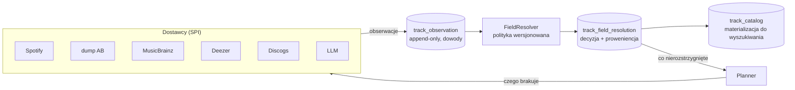

# Wzbogacanie v2 — projekt od nowa

Status: **propozycja do zatwierdzenia**. Zastępuje kaskadę z [D6](DECYZJE.md#d6-odchudzone-źródła-danych--kaskada-bpm)
i grupy pól z [D11](DECYZJE.md#d11-grupy-pól-wzbogacania-metadata--audio--ai).
Rozstrzygnięcie docelowe: D24. Zmiana dotyka zamrożonego schematu (M1.1), więc
wymaga jawnej decyzji — ten dokument jest jej uzasadnieniem.

**Założenia właściciela przyjęte na wejściu:** biblioteka istnieje wyłącznie na
Spotify (brak plików lokalnych), **nie implementujemy własnej analizy audio**,
a pole bez pomiaru zostaje **puste i oznaczone** zamiast wypełnione zgadywanką.

---

## 1. Co jest nie tak z obecnym wzbogacaniem

Pipeline z M1.6 działa i jest restartowalny — problem nie leży w Spring Batchu,
tylko w modelu danych o pochodzeniu wiedzy.

**1.1. Kaskada zaszyta w `if`-ach.** `TrackEnricher.enrich()` to trzy `if`y
i sztywna kolejność, a `BpmResolver` zna Deezera i AcousticBrainz z nazwy.
Dodanie źródła znaczy edycję serca pipeline'u.

**1.2. Ostatni zapis wygrywa, bez śladu.** `applyMetadata` nadpisuje bezwarunkowo,
`applyAnalysis` przepisuje wszystkie pola AI przy każdym przebiegu. Jedyna
proweniencja w całym modelu to `bpm_source` — jedno pole na dwadzieścia. Skąd
wzięło się `danceability`, `style` czy `energy`, nie wie nikt.

**1.3. Model językowy w roli źródła faktów.** W próbie generalnej M1.9 **24% BPM
pochodziło z LLM-a** i niczym nie różni się w bazie od wartości zmierzonej. Zły
BPM jest gorszy niż brak: po cichu zatruwa krzywą tempa, statystyki setu, `dj_slot`
i auto-układanie wg faz — czyli wszystko, po co ta aplikacja powstała.

**1.4. Konflikty źródeł są niewidzialne.** AB mówi 92, Deezer 184 — kaskada bierze
AB i nigdy się nie dowiaduje, że drugie źródło właśnie zgłosiło klasyczny half-time.
Zgodność dwóch niezależnych źródeł to najtańszy sygnał jakości, jaki mamy, a dziś
ląduje w koszu.

**1.5. Praca marnowana.** `applyAudio` woła MusicBrainz dla każdego utworu z ISRC,
nawet gdy `audio_features` są już w bazie. Zakres `MISSING` działa na poziomie
grupy pól, nie pola: brak jednego `musical_key` ściąga cały blok AUDIO razem
z odpytaniem Deezera o BPM, który już jest.

**1.6. Odpytujemy garść pól z bogatych źródeł.** To największa strata i sedno
przemyślenia źródeł:

- z **MusicBrainz** bierzemy wyłącznie MBID, a wyrzucamy gatunki z głosami,
  **datę pierwszego wydania** (Spotify podaje rok reedycji), kraj artysty,
  **język tekstu** przez encję `work`, relacje „cover of" / „remix of" oraz
  pełną listę ISRC — czyli klucz do dedupu wersji tego samego nagrania;
- z **dumpa AcousticBrainz** importujemy trzy pola z warstwy *lowlevel*, a **cały
  dump high-level leży nieruszony**: `mood_party`, `mood_happy`, `mood_aggressive`,
  `mood_relaxed`, `danceability`, `voice_instrumental`, `average_loudness`,
  `initial_key` + `key_strength`, klasyfikatory gatunku. To jest dokładnie ta
  warstwa, która odpowiada na pytania DJ-a, i jest za darmo w pliku, który i tak
  pobieramy;
- z **Deezera** bierzemy `bpm` i ignorujemy `gain` (głośność — twardy sygnał
  energii), `rank`, `release_date` i gatunki albumu;
- ze **Spotify** nie bierzemy `genres[]` z obiektu artysty — a to pole *nie jest*
  objęte deprecjacją, w odróżnieniu od `audio-features`.

**1.7. Grupy pól to zła oś podziału.** METADATA / AUDIO / AI miesza „co" (pole),
„skąd" (źródło) i „jak pewne" (fakt vs estymacja). Stąd bierze się 1.5 i to, że
nie da się powiedzieć „odśwież same opisy PL, bo zmieniłem prompt".

## 2. Co się zmieniło na zewnątrz od czasu D6

| Fakt | Konsekwencja dla projektu |
|---|---|
| Spotify `audio-features` i `audio-analysis` — deprecjacja od 27.11.2024, bez zamiennika, w 2026 bez odwrotu | źródło, którego i tak nie używaliśmy, nie wróci — nie ma na co czekać |
| Spotify `preview_url` martwe dla nowych aplikacji | odpada najprostsza droga do własnej analizy audio (i tak wykluczonej decyzją właściciela) |
| Spotify: tryb rozszerzony wymaga skali, której narzędzie osobiste nie osiągnie | Spotify na zawsze zostaje **źródłem metadanych**, nie cech audio |
| AcousticBrainz zamrożony na dumpie 06.2022, ale **dump nadal do pobrania** (~7,5 mln nagrań, lowlevel + high-level) | jedyne *zmierzone* dane, jakie mamy — tym bardziej trzeba wycisnąć z nich wszystko, nie 3 pola |
| Deezer i iTunes Search nadal bez auth | zostają jako darmowe źródła deklarowane |

Wniosek: warstwa faktów nie odbuduje się sama. Skoro **nie mierzymy dźwięku**,
jedyną dźwignią jakości jest *pełniejsze* korzystanie ze źródeł, które już mamy,
plus jedno nowe (Discogs) — i uczciwe raportowanie tego, czego nie wiemy.

## 3. Architektura: trzy warstwy zamiast jednej kaskady

Zmiana modelu z „źródło zapisuje do katalogu" na **„źródło zgłasza obserwację,
a katalog jest wyliczany"**.



### 3.1. Warstwa obserwacji — dowody, nie wyniki

Każde źródło zgłasza `Observation(spotify_id, field, value, source, tier,
confidence, observed_at, source_version)`. Reguły:

- **żadne źródło nie nadpisuje innego** — Deezer i AB mogą mieć różne BPM i oba
  zostają w bazie;
- **odpowiedź negatywna też jest obserwacją** (`outcome = NOT_FOUND`) — planner
  nie pyta drugi raz. To uogólnienie negative cache'u z D18 na wszystkie źródła,
  dzięki czemu `musicbrainz_isrc_cache` znika jako byt specjalny;
- tabela jest **trwałym cache'em faktów** — ponowne wzbogacanie nie generuje ruchu
  sieciowego dla pól już zebranych.

Skala: 2500 utworów × ~20 pól × ~6 źródeł ≈ 300 tys. wierszy w najgorszym razie —
dla Postgresa to nic.

### 3.2. Warstwa rozstrzygania — polityka, nie kolejność `if`-ów

Wartość w katalogu jest **funkcją obserwacji**, liczoną lokalnie, bez sieci:

- **warstwy prawdy:** `MEASURED` (z analizy audio — dziś tylko dump AB) >
  `DECLARED` (Deezer, Spotify, MusicBrainz, Discogs) > `INFERRED` (LLM);
- **zgoda podnosi pewność, konflikt ją obniża i jest widoczny:** dwa niezależne
  źródła w granicach ±2 BPM → `confidence = high`; rozjazd dokładnie 2× → wykryty
  half-time, rozstrzygany po gatunku — `HalfTimeCorrector` przestaje być ślepym
  mnożnikiem, bo ma drugą opinię; rozjazd inny niż oktawa tempa → `confidence = low`
  i znacznik **„sporne"** w UI;
- **zmiana polityki = przeliczenie z bazy.** Zero zapytań, zero kosztu. Dziś zmiana
  progu half-time wymaga ponownego przebiegu po sieci.

`policy_version` zapisywana przy decyzji — widać, które wartości pochodzą ze starej
reguły i wymagają przeliczenia.

### 3.3. Warstwa dostawców — SPI zamiast gałęzi kodu

```java
public interface EnrichmentProvider {

    ProviderId id();

    /** Pola, które to źródło umie dostarczyć. */
    Set<Field> provides();

    /** MEASURED | DECLARED | INFERRED — wpływa na priorytet w rozstrzyganiu. */
    Tier tier();

    /** FREE_LOCAL | FREE_NETWORK | PAID — porządkuje plan wywołań. */
    CostClass cost();

    List<Observation> fetch(List<TrackCatalog> batch, Set<Field> wanted);
}
```

Dodanie Discogs to jedna klasa i wpis w konfiguracji. `TrackEnricher` i
`BpmResolver` znikają — ich wiedza rozkłada się na dostawców (co umiem) i resolver
(komu wierzyć).

### 3.4. Planner zamiast `scope × fields`

Job pyta nie „które utwory", tylko **„które pary (utwór, pole) są nierozstrzygnięte
albo przeterminowane"**, i układa plan wywołań rosnąco po koszcie, przerywając
w chwili, gdy pole osiąga wymaganą pewność. Konsekwencje:

- MusicBrainz nie jest wołany, gdy nic z niego nie jest potrzebne (naprawia 1.5);
- **LLM dostaje wyłącznie pola, których nie dały darmowe źródła — z konstrukcji,
  a nie z kolejności `if`-ów**;
- plan ma **budżet** (limit wywołań / koszt na przebieg) — parametr zlecenia;
- „odśwież same opisy PL po zmianie promptu" to naturalne zapytanie: pola
  `description_pl` z `prompt_version < v2`.

## 4. Źródła danych — przemyślane od zera

| Źródło | Co bierzemy dziś | **Co dobieramy** | Auth / limit |
|---|---|---|---|
| **Spotify** | metadane, ISRC, popularity, okładka | `genres[]` z obiektu artysty | CC + OAuth (D4) |
| **Dump AB lowlevel** | bpm, key, danceability | — | offline |
| **Dump AB high-level** | *nic* | **mood_party, mood_happy, mood_aggressive, mood_relaxed, danceability, voice_instrumental, average_loudness, initial_key + key_strength, klasyfikatory gatunku** | offline |
| **MusicBrainz** | MBID | **gatunki z głosami, data 1. wydania, kraj artysty, język tekstu (`work`), relacje cover/remix, pełna lista ISRC** | User-Agent, 1 req/s |
| **Deezer** | bpm | **gain (→ energia), rank, release_date, gatunki albumu** | brak |
| **Discogs** *(nowe)* | — | **genre + style: Italo-Disco, Euro-Disco, Salsa, Merengue…** — najlepsza taksonomia stylu, jaka istnieje | token, 60 req/min |
| **Last.fm / ListenBrainz** *(opcjonalne)* | — | tagi społecznościowe, popularność — materiał dla konsolidacji | UA / klucz |
| **LLM** | style, gatunek, temat, opis, energia, **bpm** | **konsolidacja + polszczyzna, zero liczb** | klucz providera |

**Discogs wraca do gry** (D6 go wyciął) z konkretnego powodu: przy rezygnacji
z własnej analizy to jedyne źródło, które nazwie po imieniu „italo disco",
„salsa dura" czy „euro disco" — czyli dokładnie te wartości, które `style` (D8)
ma trzymać, a które dziś **zmyśla model językowy**. Obecność „disco polo"
w taksonomii Discogs wymaga sprawdzenia na realnej próbce; jeśli jej nie ma, kupka
tagów i tak trafia do konsolidacji, więc źródło nie jest zmarnowane.

**GetSongBPM** — opcjonalny dostawca BPM/tonacji w warstwie `DECLARED`, darmowy,
ale **wymaga widocznego linku zwrotnego w UI**. Do rozważenia dopiero, jeśli po
M4.3 pokrycie BPM zostanie poniżej progu; wchodzi bez zmian w architekturze,
bo to zwykły `EnrichmentProvider`.

### 4.1. Nowe pola, które z tego wynikają

Nie „bo są dostępne", tylko dlatego, że zmieniają decyzję DJ-a przy pulpicie:

| Pole | Skąd | Po co |
|---|---|---|
| **`lyrics_language`** | MB `work.language`, potem LLM | na polskim weselu decyduje, czy sala śpiewa — informacja pierwszej wagi |
| **`first_release_year`** | MB, Deezer `release_date` | sety retro; Spotify podaje rok reedycji, nie premiery |
| **`voice_instrumental`** | AB high-level | instrumental pod rozmowy gości, wokal na parkiet |
| **`mood_party`** | AB high-level | zmierzony odpowiednik `dj_slot` — sprawdzian dla kaskady D21 |
| **`average_loudness`** | AB high-level, Deezer `gain` | twardy sygnał energii zamiast `low/medium/high` od modelu |
| **`recording_key` + `key_strength`** | AB high-level | Camelot i miksowanie harmoniczne — **pokazywane tylko przy wysokim `key_strength`** |
| **`canonical_recording_id`** | ISRC / MBID | dedup „ta sama piosenka pod trzema Spotify ID" (Remastered 2011, wersja albumowa, singiel) — realny problem przy imporcie z wielu playlist |

## 5. LLM — z wyroczni na tłumacza

Dziś prompt dostaje `title / artist / album / year` i ma z tego wyprodukować
gatunek, styl, energię **i liczbę BPM**. To zgadywanie z tytułu.

W v2 prompt dostaje **całą zebraną kupkę faktów**: tagi z MusicBrainz i Discogs,
gatunki artysty ze Spotify, nastroje z AB, kraj artysty, rok premiery, język.
Zadania modelu zawężają się do czterech:

1. **`genre_family`** — mapowanie kupki tagów na enum D8 (klasyfikacja z materiałem
   dowodowym, nie zgadywanie),
2. **`style`** — wybór jednej wartości z tagów Discogs/MB,
3. **`lyrics_theme`** i **`description_pl`** — jedyne pola, w których generowanie
   tekstu jest sensem istnienia modelu,
4. `confidence` **per pole**, nie jedno na cały utwór.

**`bpm_estimate` znika z promptu i z kontraktu.** `energy` przestaje być zgadywane,
gdy jest `average_loudness` lub `mood_party` z AB.

Efekt uboczny: krótsze wyjście i lepszy materiał wejściowy, więc **taniej i celniej
jednocześnie**. Prompt `track-analysis-v2` — stary zostaje w repo, bo `prompt_version`
przy obserwacji pozwala odróżnić, co zostało wygenerowane czym.

## 6. Uczciwość braków (decyzja właściciela)

- `bpm IS NULL` → w UI **„niezmierzone"**, nigdy 0 i nigdy wartość zgadnięta;
- krzywa tempa rysuje **przerwę**, nie interpolację; statystyki setu podają, z ilu
  utworów policzono średnią; auto-układanie wg faz **pomija** utwory bez BPM
  zamiast wrzucać je do rozgrzewki (dziś kaskada D21 przy braku BPM i energii nie
  daje slotu — to zostaje, ale przestaje być maskowane zgadywanym BPM);
- panel wzbogacania pokazuje pokrycie **per pole i per źródło** oraz listę
  **„sporne"** (konflikt źródeł) — to jest kolejka pracy, a nie trzy paski postępu;
- każde pole w szufladzie utworu ma **znacznik pochodzenia** (zmierzone /
  deklarowane / wywnioskowane) — jedno spojrzenie mówi, czemu można ufać.

## 7. Schemat — zmiana zamrożonego modelu (migracja V5)

```sql
-- dowody: append-only, jedno źródło = jedna opinia o jednym polu
CREATE TABLE track_observation (
    id             bigserial   PRIMARY KEY,
    spotify_id     varchar(64) NOT NULL REFERENCES track_catalog (spotify_id) ON DELETE CASCADE,
    field          varchar(48) NOT NULL,   -- enum Field
    source         varchar(32) NOT NULL,   -- enum ProviderId
    tier           varchar(16) NOT NULL,   -- MEASURED | DECLARED | INFERRED
    outcome        varchar(16) NOT NULL,   -- VALUE | NOT_FOUND | ERROR
    value_text     text,
    value_num      numeric(12,4),
    confidence     numeric(4,3),
    observed_at    timestamptz NOT NULL,
    source_version varchar(64),            -- wersja dumpa / promptu / modelu
    CONSTRAINT uq_track_observation UNIQUE (spotify_id, field, source, source_version)
);

-- decyzja: co wygrało, dlaczego i wg jakiej polityki
CREATE TABLE track_field_resolution (
    spotify_id     varchar(64) NOT NULL REFERENCES track_catalog (spotify_id) ON DELETE CASCADE,
    field          varchar(48) NOT NULL,
    source         varchar(32) NOT NULL,
    tier           varchar(16) NOT NULL,
    confidence     numeric(4,3),
    disputed       boolean     NOT NULL DEFAULT false,
    resolved_at    timestamptz NOT NULL,
    policy_version integer     NOT NULL,
    PRIMARY KEY (spotify_id, field)
);
```

`track_catalog` **zostaje** — jako materializacja rozstrzygnięć pod wyszukiwanie,
sortowanie i indeksy (D22: sortuje baza, nie przeglądarka). Kolumny nowych pól
z §4.1 dochodzą do niego zwykłą migracją. `bpm_source` zostaje jako projekcja
`track_field_resolution` dla zgodności; `confidence`, `model_used`
i `enrich_version` przestają być globalne dla utworu — ich sens przejmuje
rozstrzygnięcie per pole.

**Migracja bez big-bangu:** backfill obserwacji z obecnych kolumn (`bpm` +
`bpm_source` → obserwacja o odpowiedniej warstwie; pola AI → obserwacje
`INFERRED` z `model_used`/`enrich_version` jako `source_version`), więc dotychczasowa
praca nie ginie i od pierwszego dnia widać, ile katalogu stoi na zgadywaniu.
`musicbrainz_isrc_cache` (D18) wchłonięty przez `track_observation`.

**Zgodność API:** `POST /api/enrich` zachowuje kontrakt z grupami pól — planner
mapuje `METADATA/AUDIO/AI` na zbiory pól. Nowe możliwości (pojedyncze pola, budżet,
kolejka spornych) dochodzą jako parametry opcjonalne, więc front z M3.x działa
bez zmian do czasu M4.6.

## 8. Ryzyka

| Ryzyko | Wpływ | Mitygacja |
|---|---|---|
| **Pokrycie BPM spadnie** — rezygnacja z estymacji LLM zabiera ~24 pkt proc. z raportowanych 100% | część biblioteki bez BPM | to świadomy koszt uczciwości; rekompensata: AB high-level + Deezer `gain` + opcjonalny GetSongBPM; **realny pomiar przed i po w M4.3** |
| Dump AB high-level nie pokryje disco polo i długiego ogona latino | braki tam, gdzie boli | Discogs + tagi MB zasilają przynajmniej gatunek i styl; braki są **widoczne**, a nie zamaskowane |
| Discogs 60 req/min i dopasowanie po `artist + release` bywa zawodne | wolne pierwsze wzbogacanie, część nietrafiona | dopasowanie po ISRC/MBID zanim po nazwie; obserwacja `NOT_FOUND` blokuje ponowne pytanie; limiter z `common/ratelimit` |
| Wzrost złożoności: 3 warstwy zamiast jednego enrichera | trudniejsze wejście w kod | granice są ostre (dostawca = „co umiem", resolver = „komu wierzę", planner = „co i w jakiej kolejności"); każda testowalna osobno, bez sieci |
| Zmiana zamrożonego schematu (M1.1) | ryzyko dryfu | jedna migracja V5, backfill idempotentny, `track_catalog` zachowany jako projekcja |

## 9. Rozbicie na kamienie (Etap 4)

| Kamień | Zakres | Zależy od |
|---|---|---|
| **M4.1** Warstwa obserwacji i rozstrzygania | migracja V5, `Field`/`Tier`/`ProviderId`, `FieldResolver` z polityką wersjonowaną, backfill z obecnych kolumn, przeliczanie bez sieci | — |
| **M4.2** SPI dostawców + planner | `EnrichmentProvider`, przepisanie Spotify/AB/MB/Deezer/LLM na dostawców, planner par (utwór, pole) z budżetem, job na plannerze; `TrackEnricher` i `BpmResolver` znikają | M4.1 |
| **M4.3** Żniwa z istniejących źródeł | ETL dumpa **high-level**, pełne MusicBrainz, pełny Deezer, `genres[]` artysty ze Spotify, **pomiar pokrycia przed/po** | M4.2 |
| **M4.4** Discogs + nowe pola | dostawca Discogs, `lyrics_language`, `first_release_year`, `canonical_recording_id`, dedup wersji | M4.2 |
| **M4.5** Prompt v2 | LLM jako konsolidator: wejście = kupka faktów, wyjście bez liczb, `confidence` per pole | M4.3, M4.4 |
| **M4.6** UI uczciwych braków | „niezmierzone" zamiast pustki, znacznik pochodzenia per pole, pokrycie per pole/źródło, kolejka spornych, przerwa w krzywej tempa | M4.5 |

Kolejność wymuszona: M4.1 blokuje wszystko (jak M1.1 w Etapie 1); M4.3 ∥ M4.4.

---

**Źródła weryfikacji stanu zewnętrznych API (lipiec 2026):**
[Spotify Web API changelog](https://developer.spotify.com/documentation/web-api/references/changes/february-2026) ·
[podsumowanie deprecjacji Spotify](https://developers.brizm.dev/blog/spotify-api-changes-2026/) ·
[AcousticBrainz — pobieranie dumpów](https://acousticbrainz.org/download) ·
[AcousticBrainz: status i dane po zamknięciu](https://freqblog.com/blog/acousticbrainz-alternative/) ·
[pola high-level AB (plugin beets)](https://beets.readthedocs.io/en/v2.5.0/plugins/acousticbrainz.html) ·
[Discogs — genres/styles](https://support.discogs.com/hc/en-us/articles/360005055213-Database-Guidelines-9-Genres-Styles) ·
[Discogs API](https://www.discogs.com/developers) ·
[GetSongBPM API](https://getsongbpm.com/api) ·
[iTunes Search API](https://developer.apple.com/library/archive/documentation/AudioVideo/Conceptual/iTuneSearchAPI/index.html)
